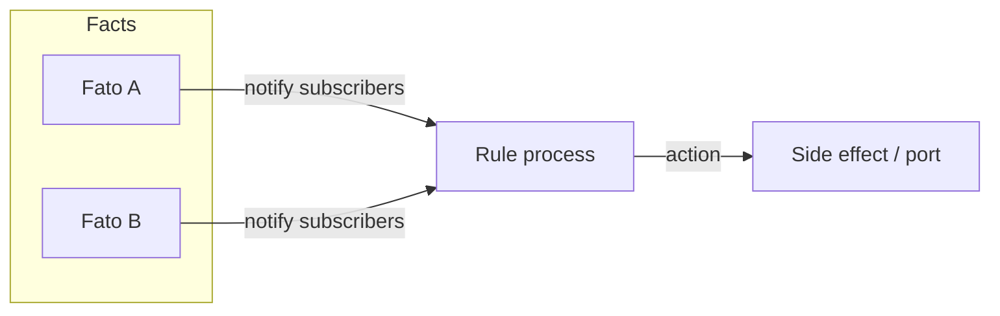

*If this helped you, you can [support the author with a coffee on dev.to](https://dev.to/matheuscamarques/support-with-a-coffee-2oa0).*

# Notification-Oriented Paradigm (PON) in Elixir: why the BEAM fits reactive rules

**Part 1 of 12** — This series documents a proof-of-concept **Notification-Oriented Paradigm (PON)** engine in Elixir, a **hexagonal** boundary around it, and a **Smart Brewery** digital twin used as a stress lab (simulation, LiveView, telemetry, TimescaleDB, and ML hooks). Here we set the vocabulary and motivation; later posts walk through OTP wiring, the metaprogrammed DSL, the brewery case study, and hard-won performance lessons.

---

Industrial software, building automation, and operations dashboards all share a pattern: **when the world changes, something should happen**—open a valve, raise an alarm, enqueue a job, or just refresh a score. You can implement that as a big imperative script, a rules engine, or a graph of small reactive pieces. The **Notification-Oriented Paradigm (PON)** takes the last path: **facts** hold state, **rules** react when relevant facts change, and work propagates by **notifications** rather than by constantly re-scanning everything. In the literature the same idea is often called the **Notification Oriented Paradigm (NOP)** and has been formalized as a contrast to purely imperative control flow—see Simão et al.’s comparative study ([SCIRP / IJSEA, 2013](https://www.scirp.org/journal/paperinformation?paperid=19842)); this series uses **PON** as shorthand aligned with that work.

This post argues that **Erlang/OTP and Elixir** are an unusually good runtime for that shape of system: lightweight processes, message passing, selective receive, and supervision map cleanly onto “many small actors that wake up when told”—the same “let it fail / isolate errors” philosophy Armstrong captured in his thesis on building reliable distributed systems ([Armstrong 2003](https://www.erlang.org/download/armstrong_thesis_2003.pdf)). I’ll contrast that intuition with a familiar alternative—**polling**—and show minimal **real** API snippets from the **`tec0301_pon`** application ([source on GitHub](https://github.com/matheuscamarques/tec0301_pon)).

## PON in one picture: facts, rules, and premises

In PON-flavored designs you typically have:

- **Facts** — Named pieces of state (e.g. current temperature, pump state). When a fact’s value changes, interested parties are **notified**.
- **Rules** — Logic of the form “when these facts look like *this*, do *that*.” A rule only needs to run when one of the facts it **watches** has changed (or when a derived signal changes).
- **Premises** (optional layer) — Reusable “derived facts”: watch raw inputs, evaluate a boolean or value, and **update** another fact only when the result changes—so downstream rules stay simple.

The important shift from a naive loop is **causality**: evaluation is **pushed** by updates, not **pulled** on a timer for the whole model.



In the PoC, a **fact** is a `GenServer` registered by name; a **rule** is another process that subscribes to the fact names it cares about and re-evaluates when notifications arrive. The next installment in this series will open the hood on `Registry`, pub/sub keys, and message batching—without drowning newcomers in OTP details on day one.

## Polling vs notification-driven evaluation

**Polling** is easy to explain: every *N* milliseconds, read whatever you need and run your conditions.

```elixir
# Illustrative anti-pattern: periodic full re-check (simplified)
defmodule PollExample do
  def loop(state) do
    temp = read_temperature_somewhere()
    pump = read_pump_somewhere()

    if temp > 80 and pump == :off do
      start_pump()
    end

    Process.send_after(self(), :tick, 500)
    loop(state)
  end
end
```

Problems multiply as the model grows: you pay the cost of **every** read and **every** condition on every tick, latency is bounded below by the interval, and reasoning about ordering under load gets harder.

**Notification-driven** evaluation flips the dependency: when a fact changes, **only** rules that subscribed to that fact are nudged. Unrelated rules stay asleep. That matches how operators think (“something changed → react”), and it scales better when facts are numerous but sparse in how they combine.

The PoC doubles down on “don’t spam subscribers”: if you write the **same** value again, the fact process avoids dispatching (see `Tec0301Pon.PON.Fato`’s `atualizar/2` behavior). [**Part 10 on dev.to**](https://dev.to/matheuscamarques/when-notifications-explode-message-storms-deduplication-and-back-pressure-in-pon-34p4) goes deeper on **message storms**, coalescing batches, and back-pressure when simulations get cruel.

## Why the BEAM fits reactive rules

1. **Isolation** — Each rule can be a process with its own mailbox and memory snapshot of watched facts. A buggy rule is easier to fence than a single giant evaluator thread.
2. **Cheap concurrency** — Spawning thousands of processes is normal. That matches a graph of many small rules rather than one monolithic engine.
3. **Messages as notifications** — `handle_info/2` and selective `receive` are a natural transport for “fact *X* is now *v*.”
4. **Supervision** — Facts and rules can live under supervisors; restarts and upgrades are first-class OTP concerns (hot code swap for rule modules is a theme in later parts).

None of this claims PON **requires** Elixir—but the **shape** of OTP makes the mapping from paper diagrams to running code short and honest.

**Compared with “one big inference engine.”** Classical Rete-style engines excel when you centralize thousands of rules over a shared working memory. PON leans toward **decentralized** graphs: facts and rules as collaborating nodes, with notifications as the glue. On the BEAM, that decentralization is not a hack—it is how the runtime already wants you to structure fault-tolerant systems. You still must design for **ordering** (two rules firing “at the same time” are two processes handling messages), and for **storms** when sensors or simulations chatter; those are engineering topics, not reasons to give up on notification-driven design.

The academic line on PON (e.g. work by Simão and collaborators) emphasizes **causality** and avoiding redundant evaluation. This series stays implementation-focused, but that research is the conceptual backbone if you want the formal side.

## Minimal API: facts and a rule (from `tec0301_pon`)

Assume your application has started the `tec0301_pon` supervision tree (so ETS tables and registry helpers exist). You can register **facts** by name and **update** them; **rules** can be started with anonymous functions for condition and action—the DSL in the next sections is sugar on top of this.

**Facts**

```elixir
alias Tec0301Pon.PON.Fato

{:ok, _} = Fato.start_link(:temperature, 20)
{:ok, _} = Fato.start_link(:pump_state, :off)

Fato.atualizar(:temperature, 28)
Fato.obter(:temperature)
# => 28
```

**Rule** (watches `:temperature` and `:pump_state`; `memoria` is the rule’s cached map of last known values)

```elixir
alias Tec0301Pon.PON.Regra

condition = fn mem ->
  (mem[:temperature] || 0) > 80 and mem[:pump_state] == :off
end

action = fn _mem ->
  IO.puts("Start pump — high temperature with pump off")
  # In real code: call a port / adapter, not raw side effects in the rule
end

{:ok, _pid} =
  Regra.start_link([:temperature, :pump_state], condition, action)
```

When `Fato.atualizar/2` changes a watched fact, matching rules re-evaluate. The actual subscription mechanism uses `Registry` under a dedicated pub/sub key—[**Part 2 on dev.to**](https://dev.to/matheuscamarques/from-whiteboard-to-code-mapping-facts-rules-and-premises-to-otp-processes-1blb) will trace a notification end to end.

## Teaser: DSL with `defrule` and `defpremissa`

To cut boilerplate, the PoC provides `Tec0301Pon.PON.Builder` with `defpremissa` and `defrule`. We’ll unpack the macro layer and hot-swappable rule modules in **Parts 3–4**; for now, a compact taste of what application code looks like:

```elixir
defmodule MyApp.BreweryRules do
  use Tec0301Pon.PON.Builder

  defpremissa HighTemp,
    watch: [:ambient_temp],
    when: (memoria[:ambient_temp] || 0) > 30,
    derive: :high_temp,
    criar_fato: true

  defrule CoolDown,
    watch: [:high_temp, :compressor_state],
    when: memoria[:high_temp] == true and memoria[:compressor_state] == :off,
    do: MyApp.Actuators.start_compressor()
end
```

Bootstrap order matters: start the underlying facts, then premise processes, then rules (see the library docs and tests). The **Smart Brewery** simulation in this repo uses richer graphs; [**Part 5 on dev.to**](https://dev.to/matheuscamarques/smart-brewery-a-digital-twin-brewery-as-a-pon-lab-36mf) introduces that domain.

## What we are not covering yet

- **Registry topology**, `Service` registration, and integration tests — [**Part 2 on dev.to**](https://dev.to/matheuscamarques/from-whiteboard-to-code-mapping-facts-rules-and-premises-to-otp-processes-1blb).
- **Macros**, `instigations`, and **hexagonal** ports — **Parts 3–4**.
- **LiveView**, **Broadway/GenStage**, **TimescaleDB**, **ML export/import** — **Parts 5–9**.
- **Message storms**, deduplication, profiling — [**Part 10 on dev.to**](https://dev.to/matheuscamarques/when-notifications-explode-message-storms-deduplication-and-back-pressure-in-pon-34p4); [**Part 11 on dev.to**](https://dev.to/matheuscamarques/dev-profiling-cpu-memory-and-what-changed-after-optimizations-28hb) (profiling).

If you are building something similar, treat this series as a field report: what worked, what hurt, and where we measured before optimizing.

## Summary

PON-style systems want **notifications**, not blind periodic scans. Elixir on the BEAM gives you **processes**, **messages**, and **supervision** that align with facts and rules as concurrent actors. The `tec0301_pon` PoC makes that concrete with `Fato`, `Regra`, and a `Builder` DSL—enough to follow along in code while the architecture story unfolds.

## References and further reading

- **Simão et al. (2013)** — *Notification Oriented Paradigm (NOP) and Imperative Paradigm: A Comparative Study* — [SCIRP paper information](https://www.scirp.org/journal/paperinformation?paperid=19842) (conceptual backdrop for notification-driven rules).
- **Armstrong (2003)** — *Making reliable distributed systems in the presence of software errors* — [PhD thesis (PDF)](https://www.erlang.org/download/armstrong_thesis_2003.pdf) (process isolation, supervision, “let it fail”).
- **Elixir** — [`GenServer`](https://hexdocs.pm/elixir/GenServer.html), [`Registry`](https://hexdocs.pm/elixir/Registry.html), [`Supervisor`](https://hexdocs.pm/elixir/Supervisor.html) on HexDocs.
- **Cesarini & Thompson** — *Programming Erlang* (2nd ed., Pragmatic) — OTP patterns in book form.
- **In this repo** — `mix docs`; modules `Tec0301Pon.PON.Fato`, `Tec0301Pon.PON.Regra`, `Tec0301Pon.PON.Builder`. Expanded list: [Bibliography on dev.to — PON + Smart Brewery series (EN drafts)](https://dev.to/matheuscamarques/bibliography-pon-smart-brewery-devto-series-en-drafts-58a9) · [repo draft](../BIBLIOGRAPHY_PON_SERIES.md).

---

**Published on dev.to:** [Notification-Oriented Paradigm (PON) in Elixir: why the BEAM fits reactive rules](https://dev.to/matheuscamarques/notification-oriented-paradigm-pon-in-elixir-why-the-beam-fits-reactive-rules-2p9e) — tracked in [`docs/devto_serie_pon_smart_brewery.md`](../../devto_serie_pon_smart_brewery.md).

**Next:** [Part 2 on dev.to — From whiteboard to code: mapping Facts, Rules, and Premises to OTP processes](https://dev.to/matheuscamarques/from-whiteboard-to-code-mapping-facts-rules-and-premises-to-otp-processes-1blb) · [repo draft](02_from_whiteboard_to_code_otp.md). Author hub: [dev.to/matheuscamarques](https://dev.to/matheuscamarques). Suggested dev.to tags: `elixir`, `otp`, `architecture`, `functional`, and later in the series `phoenix`, `liveview`, `timescaledb`, `machinelearning`.
