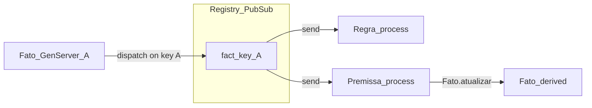

*If this helped you, you can [support the author with a coffee on dev.to](https://dev.to/matheuscamarques/support-with-a-coffee-2oa0).*

# From whiteboard to code: mapping Facts, Rules, and Premises to OTP processes

**Part 2 of 12** — In [Part 1 on dev.to — PON in Elixir: why the BEAM fits reactive rules](https://dev.to/matheuscamarques/notification-oriented-paradigm-pon-in-elixir-why-the-beam-fits-reactive-rules-2p9e) · [repo draft](01_pon_in_elixir_why_beam.md) we motivated the **Notification-Oriented Paradigm (PON)** and showed the public `Fato` / `Regra` API. This post opens the engine room: **how** updates become messages, and **how** rules and premises attach to fact names using OTP building blocks—without yet using the metaprogrammed DSL (`defrule` / `defpremissa`), which is [**Part 3 on dev.to**](https://dev.to/matheuscamarques/a-metaprogrammed-dsl-defrule-and-defpremissa-with-less-pon-boilerplate-3909).

---

## The whiteboard model

On the board you draw **facts** (ovals), **rules** (boxes that watch facts), and sometimes **premises** (derived facts). The arrow is always the same: *when this fact changes, wake up everything that cares*.

On the BEAM, a practical mapping is (the OTP design space—processes under supervision exchanging messages—is laid out in Armstrong’s thesis and in Cesarini & Thompson’s *Programming Erlang*; here we use only a thin slice):

| Concept   | In `tec0301_pon` |
|-----------|------------------|
| Fact      | A **named** `GenServer` (`Tec0301Pon.PON.Fato`) — process name = fact name (atom). |
| Bus       | A **duplicate-key** `Registry` named `Tec0301Pon.PON.PubSub` — registry key = fact atom; many processes can register under the same key. |
| Rule      | A `GenServer` (`Tec0301Pon.PON.Regra`) that **registers** under each watched fact key and handles `{:notificacao, ...}` (and batch variants). |
| Premise   | Another subscriber process (`Tec0301Pon.PON.Premissa`) that **writes** a derived fact when a boolean condition **changes**. |



## Application startup: ETS + Registry

When the `tec0301_pon` application starts, it ensures a shared ETS table for fast fact reads and starts the Registry that acts as the notification bus.

```elixir
# lib/tec0301_pon/application.ex (excerpt)
def start(_type, _args) do
  :ok = Tec0301Pon.PON.Fato.ensure_ets!()

  children = [
    {Registry,
     keys: :duplicate, name: Tec0301Pon.PON.PubSub, partitions: System.schedulers_online()}
  ]

  opts = [strategy: :one_for_one, name: Tec0301Pon.Supervisor]
  Supervisor.start_link(children, opts)
end
```

**Why `:duplicate` keys?** Under a unique-key registry, only one process could register per fact name. Here, *many* rules (and premises) may watch `:temperature`. Duplicate keys mean “topic” semantics: one key, N subscribers.

**Partitions** spread registry work across schedulers—useful when many processes register and dispatch runs hot (later posts revisit performance).

## Fact process: store, compare, dispatch

Each fact is a `GenServer` registered **both** as an OTP name (`name: nome_do_fato`) and as the **topic** for subscribers. When you call `Fato.atualizar(fact, value)`, the fact process compares the new value to the old with **`===`**. If nothing changed, it does **not** call `Registry.dispatch`—a cheap guard against useless fan-out ([**Part 10 on dev.to**](https://dev.to/matheuscamarques/when-notifications-explode-message-storms-deduplication-and-back-pressure-in-pon-34p4) goes deeper on storms and batching).

When the value **does** change, it updates ETS and dispatches to every `{pid, _value}` registered under that fact’s atom:

```elixir
# lib/tec0301_pon/pon/fato.ex — handle_cast({:atualizar, novo_valor}, estado) (excerpt)
Registry.dispatch(Tec0301Pon.PON.PubSub, estado.nome, fn inscritos ->
  for {pid, _} <- inscritos, do: send(pid, {:notificacao, estado.nome, novo_valor})
end)
```

The message shape `{:notificacao, nome_fato, novo_valor}` is the contract every subscriber implements in `handle_info/2`.

**Batch path (preview):** `Fato.atualizar_lote/1` funnels through `Tec0301Pon.PON.Fanout` and can deliver `{:notificacoes_lote, %{fato => valor, ...}}` so a rule gets **one** message per burst instead of dozens. Rules handle both shapes.

## Rule process: register, seed memory, evaluate

When a rule starts, it **subscribes** to each watched fact and **seeds** its local `memoria` map by reading current values (`Fato.obter/1`), so the first evaluation sees a consistent snapshot.

```elixir
# lib/tec0301_pon/pon/regra.ex — init/1 (excerpt)
Enum.each(estado.fatos, fn fato ->
  Registry.register(Tec0301Pon.PON.PubSub, fato, [])
end)

memoria_inicial =
  Enum.reduce(estado.fatos, %{}, fn fato, acc ->
    valor = Tec0301Pon.PON.Fato.obter(fato)
    Map.put(acc, fato, valor)
  end)

{:ok, %{estado | memoria: memoria_inicial}}
```

On each `{:notificacao, ...}`, the rule updates `memoria`, **drains** additional notifications already in the mailbox (reducing duplicate work in bursts), then runs the condition and possibly the action. A second clause handles `{:notificacoes_lote, updates}` by merging only the keys the rule watches.

## Premise process: same bus, different side effect

`Tec0301Pon.PON.Premissa` is “rule-like” in that it **registers** on source facts and receives the same notifications. Instead of firing an arbitrary action, it evaluates `condicao_fn.(memoria)` and, when the boolean **changes**, calls `Fato.atualizar(nome_fato_derivado, novo_resultado)`. That derived fact becomes another topic: downstream rules only watch the derived name.

Options include `criar_fato_derivado: true`, which starts the derived fact as `false` if it did not exist—handy in scripts and tests.

```elixir
alias Tec0301Pon.PON.{Fato, Premissa}

{:ok, _} = Fato.start_link(:sensor_temp, 18)

{:ok, _} =
  Premissa.start_link(
    :temp_high,
    [:sensor_temp],
    fn mem -> (mem[:sensor_temp] || 0) > 25 end,
    criar_fato_derivado: true
  )

Fato.atualizar(:sensor_temp, 30)
# Premissa updates :temp_high to true; subscribers to :temp_high get notified.
```

Start **source** facts before premises and rules that depend on them; order matters because `obter/1` and initial premise evaluation run at `init` time.

## Runnable sketch in `iex`

With the library as a dependency (or `path:` in `mix.exs`), after `Application.ensure_all_started(:tec0301_pon)`:

```elixir
alias Tec0301Pon.PON.{Fato, Regra}

{:ok, _} = Fato.start_link(:counter, 0)

condition = fn mem -> mem[:counter] >= 3 end
action = fn _mem -> IO.puts("counter reached 3") end

{:ok, rule_pid} = Regra.start_link([:counter], condition, action)

Fato.atualizar(:counter, 1)
Fato.atualizar(:counter, 3)
# When the condition evaluates to true after an update, the action runs.
# Use Regra.start_link(..., modulo, edge_triggered: true) for false→true transitions only (module API).

Regra.estatisticas(rule_pid)
# => %{notificacoes: ..., execucoes: ...}
```

Use `Process.sleep/1` sparingly in tests; for deterministic waits, the optional `Service` below can help drain work.

## Optional: `Service` for registration and global stats

`Tec0301Pon.PON.Service` is **not** started by `Application`. If you start it yourself, you can **register** fact names and rule pids, then query **aggregated** counters (`estatisticas_globais/0`) or call `wait_until_queues_empty/1` in tests. It does not participate in the notification protocol itself—it is observability glue.

```elixir
{:ok, _} = Tec0301Pon.PON.Service.start_link()
Tec0301Pon.PON.Service.registrar_fato(:counter, :counter)
Tec0301Pon.PON.Service.registrar_regra(:my_rule, rule_pid)
Tec0301Pon.PON.Service.estatisticas_globais()
```

## What we defer to later parts

- **`defrule` / `defpremissa` and generated modules** — [**Part 3 on dev.to**](https://dev.to/matheuscamarques/a-metaprogrammed-dsl-defrule-and-defpremissa-with-less-pon-boilerplate-3909) (metaprogramming and less boilerplate).
- **Ports & adapters** — [**Part 4 on dev.to**](https://dev.to/matheuscamarques/hexagonal-architecture-pon-ports-adapters-to-decouple-the-engine-3l54) (keeping side effects behind boundaries).
- **Message storms, coalescing, ETS tuning** — [**Part 10 on dev.to**](https://dev.to/matheuscamarques/when-notifications-explode-message-storms-deduplication-and-back-pressure-in-pon-34p4); [**Part 11 on dev.to**](https://dev.to/matheuscamarques/dev-profiling-cpu-memory-and-what-changed-after-optimizations-28hb) (profiling).

## Summary

Facts are **named GenServers**; the **Registry** `Tec0301Pon.PON.PubSub` is a **duplicate-key** topic bus. On change, a fact **dispatches** to all registered pids with `{:notificacao, name, value}`. Rules and premises are **subscriber processes** that register on fact keys and update local state or **downstream** facts. That is the whole whiteboard-to-OTP bridge in this PoC.

## References and further reading

- **Elixir `Registry`** — duplicate keys, dispatch patterns — [HexDocs](https://hexdocs.pm/elixir/Registry.html).
- **Elixir `GenServer`** — cast/call, state — [HexDocs](https://hexdocs.pm/elixir/GenServer.html).
- **Armstrong (2003)** — *Making reliable distributed systems…* — [thesis PDF](https://www.erlang.org/download/armstrong_thesis_2003.pdf).
- **Cesarini & Thompson** — *Programming Erlang* (2nd ed.) — OTP supervision and process design.
- **In this repo** — [Bibliography on dev.to — PON + Smart Brewery series (EN drafts)](https://dev.to/matheuscamarques/bibliography-pon-smart-brewery-devto-series-en-drafts-58a9) · [repo draft](../BIBLIOGRAPHY_PON_SERIES.md); **Code map:** `lib/tec0301_pon/application.ex`, `lib/tec0301_pon/pon/fato.ex`, `lib/tec0301_pon/pon/regra.ex`, `lib/tec0301_pon/pon/premissa.ex`, `lib/tec0301_pon/pon/service.ex`, `lib/tec0301_pon/pon/fanout.ex`.

---

**Published on dev.to:** [From whiteboard to code: mapping Facts, Rules, and Premises to OTP processes](https://dev.to/matheuscamarques/from-whiteboard-to-code-mapping-facts-rules-and-premises-to-otp-processes-1blb) — tracked in [`docs/devto_serie_pon_smart_brewery.md`](../../devto_serie_pon_smart_brewery.md).

**Previous:** [Part 1 on dev.to — PON in Elixir: why the BEAM fits reactive rules](https://dev.to/matheuscamarques/notification-oriented-paradigm-pon-in-elixir-why-the-beam-fits-reactive-rules-2p9e) · [repo draft](01_pon_in_elixir_why_beam.md)  
**Next:** [Part 3 on dev.to — A metaprogrammed DSL: `defrule` and `defpremissa` with less PON boilerplate](https://dev.to/matheuscamarques/a-metaprogrammed-dsl-defrule-and-defpremissa-with-less-pon-boilerplate-3909) · [repo draft](03_metaprogrammed_dsl_defrule_defpremissa.md). Author hub: [dev.to/matheuscamarques](https://dev.to/matheuscamarques); URLs tracked in [`docs/devto_serie_pon_smart_brewery.md`](../../devto_serie_pon_smart_brewery.md).
