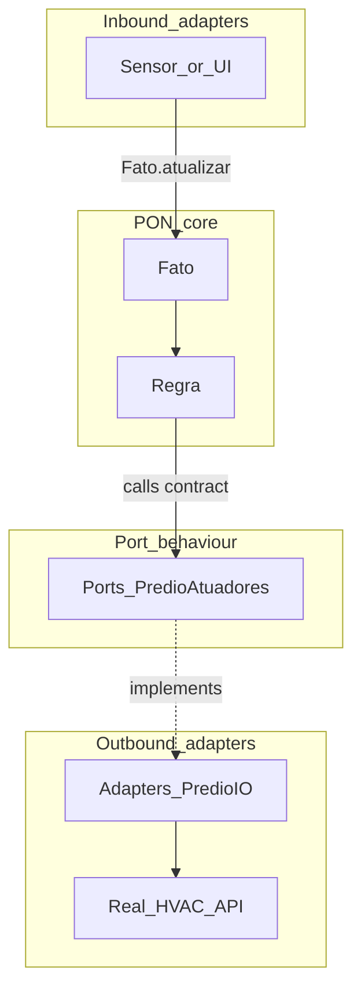

*If this helped you, you can [support the author with a coffee on dev.to](https://dev.to/matheuscamarques/support-with-a-coffee-2oa0).*

# Hexagonal architecture + PON: Ports & Adapters to decouple the engine

**Part 4 of 12** — [Part 3 on dev.to — A metaprogrammed DSL: `defrule` and `defpremissa` with less PON boilerplate](https://dev.to/matheuscamarques/a-metaprogrammed-dsl-defrule-and-defpremissa-with-less-pon-boilerplate-3909) · [repo draft](03_metaprogrammed_dsl_defrule_defpremissa.md) added `defrule` and `defpremissa` so you declare **watch / when / do** instead of hand-written `Regra` callbacks. This post draws a **boundary** between that reactive core and the messy world: databases, HTTP, MQTT, GPIO, SMS APIs. In Elixir, **Ports & Adapters** map cleanly to **behaviours** (`@callback`) and implementing modules—the same pattern this repository already uses under `lib/tec0301_pon/ports/` and `lib/tec0301_pon/adapters/`.

---

## Why hexagonal thinking matters for rules

A rule’s `do:` block is the natural place for **side effects**: sound an alarm, open a valve, enqueue a job. If you import `HTTPoison`, `GPIO`, or an Ecto repo **inside** the rule module, the PON graph becomes hard to **test** without the network, hardware, or database. Worse, you cannot swap implementations between dev, CI, and production without editing rule code.

**Hexagonal architecture**—as Cockburn described in his *ports and adapters* model ([original article](https://alistair.cockburn.us/hexagonal-architecture/); see also Fowler’s [summary](https://martinfowler.com/bliki/HexagonalArchitecture.html))—keeps the **application core** ignorant of those technologies. The core defines **ports**—interfaces for what it needs. **Adapters** sit outside and satisfy those interfaces with concrete I/O.

For PON specifically:

- **Inbound (driving):** anything that **writes facts**—sensors, Phoenix controllers, LiveView events, cron jobs—eventually calls `Fato.atualizar/2` (or your own thin wrapper). [**Part 6 on dev.to**](https://dev.to/matheuscamarques/phoenix-liveview-in-real-time-an-operations-ui-on-top-of-a-rules-engine-17ci) revisits UI; here we only name the direction.
- **Outbound (driven):** what **rules trigger** when conditions hold—notifications, actuators, persistence. This repo’s examples focus on outbound behaviours.



## Ports in Elixir: `@callback` modules

A **port** here is not the OTP `Port` for external OS processes—it is a **behaviour contract**. Example from the library:

```elixir
# lib/tec0301_pon/ports/predio_atuadores.ex (excerpt)
defmodule Tec0301Pon.Ports.PredioAtuadores do
  @moduledoc """
  Porta (Behaviour) para atuadores do prédio inteligente: iluminação, HVAC, porta de segurança.
  """
  @callback ligar_luz() :: :ok
  @callback desligar_luz() :: :ok
  @callback ligar_ar() :: :ok
  @callback ventilar() :: :ok
  @callback trancar_porta() :: :ok
end
```

Another outbound port is `Tec0301Pon.Ports.Alarme` with `@callback disparar(motivo :: String.t()) :: :ok`.

The **core** depends only on these **function signatures**, not on SMS gateways or relay boards.

## Adapters: `@behaviour` + `@impl true`

An **adapter** implements the port. The PoC ships IO-based simulations you can replace with real clients later:

```elixir
# lib/tec0301_pon/adapters/predio_io.ex (excerpt)
defmodule Tec0301Pon.Adapters.PredioIO do
  @moduledoc """
  Adaptador de saída para prédio inteligente (iluminação, HVAC, porta) — simulação com IO.
  """
  @behaviour Tec0301Pon.Ports.PredioAtuadores

  @impl true
  def ligar_luz do
    IO.puts("[Prédio] Iluminação: Luz LIGADA.")
    :ok
  end

  # ... desligar_luz, ligar_ar, ventilar, trancar_porta
end
```

```elixir
# lib/tec0301_pon/adapters/alarme_io.ex (excerpt)
defmodule Tec0301Pon.Adapters.AlarmeIO do
  @behaviour Tec0301Pon.Ports.Alarme

  @impl true
  def disparar(motivo) do
    IO.puts("[API] SMS/Push: ALARM - #{motivo}")
    :ok
  end
end
```

The test suite smoke-checks the adapter against the port (`examples_coverage_test.exs` asserts each `PredioIO` callback returns `:ok`).

## Rules that call adapters: `PredioInteligente`

`Tec0301Pon.Examples.PredioInteligente.Regras` uses the DSL and **aliases concrete adapter modules**:

```elixir
# lib/tec0301_pon/examples/predio_inteligente_regras.ex (excerpt)
use Tec0301Pon.PON.Builder
alias Tec0301Pon.Adapters.AlarmeIO
alias Tec0301Pon.Adapters.PredioIO

defrule(RegraEmergencia,
  watch: [:predio_alarme_incendio],
  when: (memoria[:predio_alarme_incendio] || false) == true,
  do:
    (
      AlarmeIO.disparar("Alarme de incêndio — modo emergência ativado.")
      Tec0301Pon.PON.Fato.atualizar(:predio_modo_emergencia, true)
    )
)

defrule(RegraVentilarCO2,
  watch: [:predio_co2_alto, :predio_modo_emergencia],
  when:
    (memoria[:predio_co2_alto] || false) == true and
      (memoria[:predio_modo_emergencia] || true) == false,
  do:
    (
      PredioIO.ventilar()
    )
)
```

This is **pragmatic**: the rules are readable, and the **behaviour** still documents the contract `PredioIO` must honor. For **strict** hexagonal purity, the rule would call only a **port-facing module** resolved at runtime (next section).

## Production-shaped indirection: config or facade

To swap adapters in tests or per environment without changing rule source, introduce a **thin facade** that delegates to a module from config:

```elixir
# Example pattern (not required by the PoC — add in your app)
defmodule MyApp.Building do
  @predio_mod Application.compile_env(:my_app, :predio_atuadores, Tec0301Pon.Adapters.PredioIO)

  def ventilar, do: @predio_mod.ventilar()
  def trancar_porta, do: @predio_mod.trancar_porta()
  # ...
end
```

Runtime (non-compile) variant:

```elixir
defmodule MyApp.Building do
  def predio_mod do
    Application.get_env(:my_app, :predio_atuadores, Tec0301Pon.Adapters.PredioIO)
  end

  def ventilar, do: predio_mod().ventilar()
end
```

In `config/test.exs`:

```elixir
config :my_app, :predio_atuadores, MyApp.Test.PredioStub
```

Rules then call `MyApp.Building.ventilar()` instead of `PredioIO.ventilar()`. The **port** (`PredioAtuadores`) is what you `@behaviour` in both `PredioIO` and `PredioStub`.

## Stub adapter for tests

```elixir
defmodule MyApp.Test.PredioStub do
  @behaviour Tec0301Pon.Ports.PredioAtuadores

  @impl true
  def ligar_luz, do: record(:ligar_luz)
  @impl true
  def desligar_luz, do: record(:desligar_luz)
  @impl true
  def ligar_ar, do: record(:ligar_ar)
  @impl true
  def ventilar, do: record(:ventilar)
  @impl true
  def trancar_porta, do: record(:trancar_porta)

  defp record(op) do
    # Rule actions run in the Regra process — send to a named test process, not self().
    if pid = Process.whereis(:predio_stub_sink), do: send(pid, {:predio_stub, op})
    :ok
  end
end
```

Register `:predio_stub_sink` as the test process (`Process.register(self(), :predio_stub_sink)` in setup), fire the graph, then `assert_receive {:predio_stub, :ventilar}`. Alternatively assert only on **fact** values and keep the stub as `:ok` no-ops.

## Inbound in three lines

An inbound adapter translates an external event into a fact change:

```elixir
# Conceptual sensor → PON
defmodule MyApp.Adapters.MqttTempSensor do
  def on_message(payload) do
    Tec0301Pon.PON.Fato.atualizar(:ambient_temp, payload.temperature_c)
  end
end
```

The **rule graph** does not know MQTT exists; it only reacts once `:ambient_temp` updates.

## What we defer

- **Smart Brewery** domain, simulation volume, and telemetry—[**Part 5 on dev.to**](https://dev.to/matheuscamarques/smart-brewery-a-digital-twin-brewery-as-a-pon-lab-36mf) onward.
- **LiveView** as an inbound adapter—[**Part 6 on dev.to**](https://dev.to/matheuscamarques/phoenix-liveview-in-real-time-an-operations-ui-on-top-of-a-rules-engine-17ci).
- Full **dependency injection** framework—behaviours + `Application.get_env/3` are enough for many Elixir apps.

## Summary

| Layer | In this repo | Role |
|-------|----------------|------|
| Port | `Tec0301Pon.Ports.*` | `@callback` contract for outbound effects |
| Adapter | `Tec0301Pon.Adapters.*` | `@behaviour` implementation (IO, HTTP, etc.) |
| Rules | `Examples.PredioInteligente.Regras` | DSL; today alias adapters directly; facades + config tighten the hexagon |

Hexagonal boundaries do not replace PON—they **wrap** it: facts and rules stay reactive; adapters keep I/O at the edges.

## References and further reading

- **Cockburn, A.** — *Hexagonal architecture* — [alistair.cockburn.us](https://alistair.cockburn.us/hexagonal-architecture/).
- **Fowler, M.** — *Hexagonal architecture* (bliki) — [martinfowler.com](https://martinfowler.com/bliki/HexagonalArchitecture.html).
- **Elixir** — [`@callback`](https://hexdocs.pm/elixir/Module.html#module-behaviour), [`@behaviour`](https://hexdocs.pm/elixir/Module.html#module-behaviour) — HexDocs `Module`.
- **In this repo** — `lib/tec0301_pon/ports/`, `lib/tec0301_pon/adapters/`, `lib/tec0301_pon/examples/predio_inteligente_regras.ex`; `Tec0301Pon` `@moduledoc` in `lib/tec0301_pon.ex`. Expanded list: [Bibliography on dev.to — PON + Smart Brewery series (EN drafts)](https://dev.to/matheuscamarques/bibliography-pon-smart-brewery-devto-series-en-drafts-58a9) · [repo draft](../BIBLIOGRAPHY_PON_SERIES.md).

---

**Published on dev.to:** [Hexagonal architecture + PON: Ports & Adapters to decouple the engine](https://dev.to/matheuscamarques/hexagonal-architecture-pon-ports-adapters-to-decouple-the-engine-3l54) — tracked in [`docs/devto_serie_pon_smart_brewery.md`](../../devto_serie_pon_smart_brewery.md).

**Previous:** [Part 3 on dev.to — A metaprogrammed DSL: `defrule` and `defpremissa` with less PON boilerplate](https://dev.to/matheuscamarques/a-metaprogrammed-dsl-defrule-and-defpremissa-with-less-pon-boilerplate-3909) · [repo draft](03_metaprogrammed_dsl_defrule_defpremissa.md)  
**Next:** [Part 5 on dev.to — Smart Brewery: a digital twin brewery as a PON lab](https://dev.to/matheuscamarques/smart-brewery-a-digital-twin-brewery-as-a-pon-lab-36mf) · [repo draft](05_smart_brewery_digital_twin_pon_lab.md).
