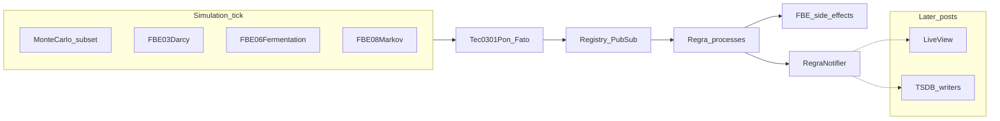

*If this helped you, you can [support the author with a coffee on dev.to](https://dev.to/matheuscamarques/support-with-a-coffee-2oa0).*

# Smart Brewery: a digital twin brewery as a PON lab

**Part 5 of 12** — [Part 4 on dev.to — Hexagonal architecture + PON: Ports & Adapters to decouple the engine](https://dev.to/matheuscamarques/hexagonal-architecture-pon-ports-adapters-to-decouple-the-engine-3l54) · [repo draft](04_hexagonal_pon_ports_adapters.md) separated **ports** from **adapters** so rule side effects stay testable. This post switches from toy examples to a **single, opinionated lab**: a **digital twin** of a brewery line implemented as a **PON graph**—dozens of facts, cross-equipment rules, scripted scenarios, and a **hybrid simulator** (physics-ish models + Monte Carlo noise) that pounds the engine the way a real plant telemetry stream would. Industry vocabulary for “twin + physical asset + lifecycle data” was popularized in part by Grieves’s digital-manufacturing framing (often cited as *Digital Twin: Manufacturing Excellence Through Virtual Factory Replication*, 2014); our twin is a **software-only** stress lab, not a certified plant model.

The code lives in the monorepo: core facts and rules under `tec0301_pon`, continuous simulation under the `simulacoes_visuais` Phoenix app.

---

## What we are simulating

The twin groups **57 facts** into **eleven functional block elements (FBEs)**—mill, mash, filter, boil, heat exchanger, two fermenters, packaging, CIP, AMR fleet, and a **smart grid** slice. **Twelve rules** (R_01–R_12) encode operational and safety logic: filtration optimization, packaging interlocks, peak-load shifting, ISO 10816-3 mill protection, NR-13 boiler limits, ISA-88 mash–filter coordination, AMR battery policy, and grid resilience—see the module documentation in `Tec0301Pon.Examples.SmartBrewery` and the full attribute/rule catalog in [`docs/smart-brewery-fatos-regras.md`](../../smart-brewery-fatos-regras.md) (repository root `docs/`).

| FBE | Name (concept) | Fact count |
|-----|----------------|------------|
| 01 | Mill / grist | 5 |
| 02 | Mash tun | 6 |
| 03 | Lauter / filter | 5 |
| 04 | Boil kettle | 5 |
| 05 | Heat exchanger | 4 |
| 06 | Fermenter A | 7 |
| 07 | Fermenter B | 6 |
| 08 | Bottling line | 6 |
| 09 | CIP | 5 |
| 10 | AMR fleet | 5 |
| 11 | Smart grid | 4 |

**Total: 57 facts**, all **atoms** backed by `Tec0301Pon.PON.Fato` processes, with the usual `Registry` fan-out from Parts 2–3.

## Bootstrapping the graph

`Tec0301Pon.Examples.SmartBrewery.start_link/0` starts every fact from the initial-value list, then starts each generated rule module (R_01 … R_12):

```elixir
# lib/tec0301_pon/examples/smart_brewery.ex (conceptual excerpt)
def start_link do
  for {nome, valor} <- @fatos_iniciais do
    Fato.start_link(nome, valor)
  end

  Tec0301Pon.Examples.SmartBrewery.Regras.RegraOtimizacaoFiltracao.start_link()
  Tec0301Pon.Examples.SmartBrewery.Regras.RegraIntertravamentoEnvase.start_link()
  Tec0301Pon.Examples.SmartBrewery.Regras.RegraSmartGridLoadBalancing.start_link()
  # ... remaining rules R_04 – R_12
  {:ok, self()}
end
```

In the Phoenix app, a **bridge** supervisor typically hosts this graph so LiveView and the Monte Carlo loop see running processes (`SimulacoesVisuais.Application` children—[**Part 6 on dev.to**](https://dev.to/matheuscamarques/phoenix-liveview-in-real-time-an-operations-ui-on-top-of-a-rules-engine-17ci) focuses on the UI).

## Rules in the wild: R_01 and R_04

Rules use `Tec0301Pon.PON.Builder` (`defrule`). **R_01** tightens filtration when differential pressure is high, clarity is poor, and pump speed is aggressive:

```elixir
# lib/tec0301_pon/examples/smart_brewery_regras.ex (excerpt — R_01)
defrule(RegraOtimizacaoFiltracao,
  watch: [:fbe_03_diff_pressure, :fbe_03_wort_clarity, :fbe_03_pump_speed],
  when:
    memoria[:fbe_03_diff_pressure] > 150 and memoria[:fbe_03_wort_clarity] < 20 and
      memoria[:fbe_03_pump_speed] > 50,
  do:
    (
      Tec0301Pon.Examples.SmartBrewery.FBE_03.reduce_pump_10pct()
      Tec0301Pon.Examples.SmartBrewery.FBE_03.lower_rake_position()
      Tec0301Pon.Examples.SmartBrewery.RegraNotifier.notify(:r_01)
    )
)
```

**R_04** protects the mill using **`edge_triggered: true`** so the action does not re-fire on every notification while the condition stays true ([Part 3 on dev.to](https://dev.to/matheuscamarques/a-metaprogrammed-dsl-defrule-and-defpremissa-with-less-pon-boilerplate-3909)):

```elixir
# lib/tec0301_pon/examples/smart_brewery_regras.ex (excerpt — R_04)
defrule(RegraProtecaoMoinho,
  watch: [
    :fbe_01_motor_temp,
    :fbe_01_vibration_level,
    :fbe_01_hopper_level,
    :fbe_01_motor_rpm,
    :fbe_01_feed_valve_state
  ],
  when:
    (memoria[:fbe_01_vibration_level] != nil and memoria[:fbe_01_vibration_level] > 80) or
      (memoria[:fbe_01_motor_temp] != nil and memoria[:fbe_01_motor_temp] > 70) or
      (memoria[:fbe_01_hopper_level] != nil and memoria[:fbe_01_motor_rpm] != nil and
         memoria[:fbe_01_hopper_level] < 15 and memoria[:fbe_01_motor_rpm] > 0),
  edge_triggered: true,
  do:
    (
      Tec0301Pon.Examples.SmartBrewery.FBE_01.reduce_motor_rpm()

      if memoria[:fbe_01_vibration_level] != nil and memoria[:fbe_01_vibration_level] > 95,
        do: Tec0301Pon.Examples.SmartBrewery.FBE_01.close_feed_valve()

      Tec0301Pon.Examples.SmartBrewery.RegraNotifier.notify(:r_04)
    )
)
```

`FBE_XX` modules update facts to represent equipment response; `RegraNotifier` feeds **observability** (PubSub / persistence hooks in the full app).

## Scripted walkthrough: `simular/0`

For demos and tests, `SmartBrewery.simular/0` drives a **narrative** sequence of `Fato.atualizar/2` calls to trigger R_01, then R_02, then R_03:

```elixir
# lib/tec0301_pon/examples/smart_brewery.ex (excerpt)
def simular do
  Fato.atualizar(:fbe_03_wort_clarity, 15)
  Fato.atualizar(:fbe_03_pump_speed, 60)
  # ...
  Fato.atualizar(:fbe_03_diff_pressure, 152)
  # ...
  Fato.atualizar(:fbe_08_capper_jam_sens, true)
  # ...
  Fato.atualizar(:fbe_09_cip_pump_state, :on)
  Fato.atualizar(:fbe_11_grid_power_cost, 180)
end
```

This is the **inbound adapter** story from Part 4 in concrete form: something external (here, a script) **pushes** world state; rules react.

## Continuous stress: hybrid Monte Carlo

Long-running exploration uses `SimulacoesVisuais.SmartBreweryMonteCarlo`—a `GenServer` that schedules **ticks**. Each tick runs **dedicated models** for key subsystems, then applies **stochastic updates** to a subset of remaining facts according to a **schema** (`{:range, min, max}`, `{:enum, [...]}`, `:bool`). Some continuous variables use a **random walk** (Gaussian step) instead of i.i.d. uniforms.

```elixir
# apps/simulacoes_visuais/lib/.../smart_brewery_monte_carlo.ex (excerpt)
def run_tick_pure(state) do
  FBE03Darcy.tick()
  FBE06Fermentation.tick()
  FBE07Fermentation.tick()
  FBE08Markov.tick()
  FBE10Markov.tick()
  FBE11SmartGrid.tick()
  state = update_fbe03_cholesky(state)
  # pick N fact names from @mc_fact_names, then:
  apply_mc_chosen_updates(chosen)
  state
end

defp apply_mc_chosen_updates([nome | rest]) do
  valor = next_value(nome)
  if valor != nil do
    Fato.atualizar(nome, valor)
  end
  apply_mc_chosen_updates(rest)
end
```

Scheduling:

```elixir
def handle_info(:tick, state) do
  new_state = run_tick_pure(state)
  Process.send_after(self(), :tick, state.interval_ms)
  {:noreply, new_state}
end
```

Facts owned by the dedicated models are **excluded** from the naive Monte Carlo list (`@excluded_from_mc`) so two writers do not fight. The LiveView **Start / Stop Monte Carlo** buttons call `SmartBreweryMonteCarlo.start_loop/0` and `stop_loop/0` ([Part 6 on dev.to](https://dev.to/matheuscamarques/phoenix-liveview-in-real-time-an-operations-ui-on-top-of-a-rules-engine-17ci)).



## Telemetry, TSDB, and the Phoenix app (teaser)

With **`:tsdb_enabled`**, the `simulacoes_visuais` app starts Ecto + **async writers** (e.g. rule events) fed from the operational pipeline—[**Part 7 on dev.to**](https://dev.to/matheuscamarques/from-simulation-to-storage-telemetry-broadwaygenstage-and-timescaledb-762) covers Broadway, batching, and TimescaleDB in depth. [**Part 6 on dev.to**](https://dev.to/matheuscamarques/phoenix-liveview-in-real-time-an-operations-ui-on-top-of-a-rules-engine-17ci) covers **LiveView** (`SmartBreweryLive`), streams, and operator UX.

**Heads-up:** a root `mix run examples/smart_brewery_simulacao.exs` path may start only `:tec0301_pon` and **not** persist to `telemetry_events`; full TSDB behavior requires the Phoenix app with the right config—see `apps/simulacoes_visuais/README.md`.

## Summary

The Smart Brewery twin is a **deliberately large PON graph**: many facts, cross-FBE rules, FBE modules that close the loop on state, plus **two simulation modes**—a **scripted** `simular/0` for storytelling and a **hybrid Monte Carlo** loop for sustained load. It is the same engine you built in Parts 1–4, now exercised like a product.

## References and further reading

- **Grieves, M.** — *Digital Twin: Manufacturing Excellence Through Virtual Factory Replication* (2014 white paper; search institutional copies) — vocabulary for twins in manufacturing.
- **Simão et al. (2013)** — NOP / notification-oriented control — [SCIRP](https://www.scirp.org/journal/paperinformation?paperid=19842) (conceptual link to PON-style updates).
- **In this repo** — [`docs/smart-brewery-fatos-regras.md`](../../smart-brewery-fatos-regras.md); `lib/tec0301_pon/examples/smart_brewery.ex`, `smart_brewery_regras.ex`, `smart_brewery_fbe.ex`; `apps/simulacoes_visuais/lib/simulacoes_visuais/smart_brewery_monte_carlo.ex`; `SimulacoesVisuaisWeb.SmartBreweryLive`. Expanded list: [Bibliography on dev.to — PON + Smart Brewery series (EN drafts)](https://dev.to/matheuscamarques/bibliography-pon-smart-brewery-devto-series-en-drafts-58a9) · [repo draft](../BIBLIOGRAPHY_PON_SERIES.md).

---

**Published on dev.to:** [Smart Brewery: a digital twin brewery as a PON lab](https://dev.to/matheuscamarques/smart-brewery-a-digital-twin-brewery-as-a-pon-lab-36mf) — tracked in [`docs/devto_serie_pon_smart_brewery.md`](../../devto_serie_pon_smart_brewery.md).

**Previous:** [Part 4 on dev.to — Hexagonal architecture + PON: Ports & Adapters to decouple the engine](https://dev.to/matheuscamarques/hexagonal-architecture-pon-ports-adapters-to-decouple-the-engine-3l54) · [repo draft](04_hexagonal_pon_ports_adapters.md)  
**Next:** [Part 6 on dev.to — Phoenix LiveView in real time: an operations UI on top of a rules engine](https://dev.to/matheuscamarques/phoenix-liveview-in-real-time-an-operations-ui-on-top-of-a-rules-engine-17ci) · [repo draft](06_phoenix_liveview_operations_ui_rules_engine.md).
