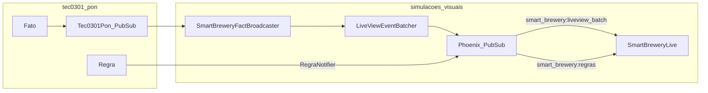

*If this helped you, you can [support the author with a coffee on dev.to](https://dev.to/matheuscamarques/support-with-a-coffee-2oa0).*

# Phoenix LiveView in real time: an operations UI on top of a rules engine

**Part 6 of 12** — [Part 5 on dev.to — Smart Brewery: a digital twin brewery as a PON lab](https://dev.to/matheuscamarques/smart-brewery-a-digital-twin-brewery-as-a-pon-lab-36mf) · [repo draft](05_smart_brewery_digital_twin_pon_lab.md) described the **Smart Brewery** digital twin: 57 `Fato` processes, twelve `defrule` modules, scripted `simular/0`, and the hybrid **Monte Carlo** loop. Operators do not introspect the `Registry` in `iex`; they need a **panel**. This post walks through **`SimulacoesVisuaisWeb.SmartBreweryLive`**: how Phoenix LiveView **subscribes** to the same changing world, why we **batch** updates, and how **rule firings** surface as log lines and visual hints—without duplicating the persistence pipeline (that is [**Part 7 on dev.to**](https://dev.to/matheuscamarques/from-simulation-to-storage-telemetry-broadwaygenstage-and-timescaledb-762)). LiveView’s model—server-owned state, incremental patches over a channel—is documented in the official [Phoenix LiveView guides](https://hexdocs.pm/phoenix_live_view/welcome.html); batching here is our **application-level back-pressure** so high telemetry rates do not flood diff generation.

---

## Route and scope

The SCADA-style dashboard is a standard LiveView route:

```elixir
# apps/simulacoes_visuais/lib/simulacoes_visuais_web/router.ex (excerpt)
scope "/", SimulacoesVisuaisWeb do
  pipe_through :browser

  live "/smart-brewery", SmartBreweryLive, :index
  live "/smart-brewery/ml-predictions", MlPredictionsLive, :index
end
```

`/smart-brewery` is the twin console; `/smart-brewery/ml-predictions` previews ML-backed views ([**Part 9 on dev.to**](https://dev.to/matheuscamarques/ml-on-the-digital-twin-export-train-pilots-and-import-predictions-back-into-the-app-207i)).

## `mount`: snapshot + subscriptions + one stream

On connect, the LiveView builds a map of current fact values (best effort via `Fato.obter/1`), subscribes to four **Phoenix PubSub** topics, and initializes an **event log** as a LiveView **stream** (append-only UI list without holding an ever-growing assign).

```elixir
# SimulacoesVisuaisWeb.SmartBreweryLive — mount/3 (excerpt)
def mount(_params, _session, socket) do
  _ = SimulacoesVisuais.SmartBrewery.CaseContext.new_session()

  fatos_names = SmartBrewery.fatos_names()

  fatos =
    Enum.into(fatos_names, %{}, fn nome ->
      {nome, safe_obter_fato(nome)}
    end)

  Phoenix.PubSub.subscribe(SimulacoesVisuais.PubSub, "smart_brewery:liveview_batch")
  Phoenix.PubSub.subscribe(SimulacoesVisuais.PubSub, "smart_brewery:oee")
  Phoenix.PubSub.subscribe(SimulacoesVisuais.PubSub, "smart_brewery:anomalias")
  Phoenix.PubSub.subscribe(SimulacoesVisuais.PubSub, "smart_brewery:regras")

  initial_entry = log_entry("sistema", "LiveView conectada. Aguardando notificações PON.")

  socket =
    socket
    |> assign(fatos_names: fatos_names, fatos: fatos)
    |> stream(:event_log, [initial_entry], dom_id: fn e -> "log-#{e.id}" end)

  {:ok, socket}
end
```

The real module chains a much larger `assign/2` before `stream/3` (FBE grouping, `view_mode`, OEE, BI filters, `pending_fato_updates`, sparklines, TSDB flags, and rule-flash state). The snippet shows the **data path** that matters here: read facts once, subscribe to four topics, seed the log stream.

- **`smart_brewery:liveview_batch`** — batched fact diffs (see below).
- **`smart_brewery:oee`**, **`smart_brewery:anomalias`** — operational KPIs and EMA-style anomaly hints.
- **`smart_brewery:regras`** — “rule R_k fired” style messages for the operator log and FBE highlight.

### Why a stream for the event log?

The operator log is a rolling tail of structured entries (`id`, timestamp, type, message). Appending with a normal assign would mean keeping the full list in memory and sending larger and larger diffs. LiveView **streams** are a good fit: each new line is `stream_insert/3` (and old rows can be pruned to respect `@max_log_entries`), so the LiveView process does not accumulate an unbounded list in a single assign. The DOM gets stable `id="log-<unique>"` nodes, which also keeps diffing predictable when Monte Carlo is noisy.

The **fact table**, by contrast, is a keyed map (`assigns.fatos`) that the template can render by FBE—better for random access and numeric formatting than streaming dozens of independent row ids.

## From PON notifications to PubSub: `SmartBreweryFactBroadcaster`

`Tec0301Pon.PON.PubSub` is the **engine** bus (Parts 2–5). The Phoenix app adds a **bridge** process that registers on every Smart Brewery fact name and forwards each `{:notificacao, name, value}` (or batch map) to telemetry **and** the UI batcher:

```elixir
# SimulacoesVisuais.SmartBreweryFactBroadcaster — push_telemetry_for_fact/2 (excerpt)
defp push_telemetry_for_fact(state, nome_do_fato, novo_valor) do
  # … GenStage.cast to Broadway producer when available, else telemetry batcher fallback …

  if Map.get(state, :push_liveview_telemetry, true) do
    SimulacoesVisuais.LiveViewEventBatcher.push(nome_do_fato, novo_valor)
  end

  state
end
```

So: **one** notification fan-out from `Fato` still happens inside `tec0301_pon`; the **Phoenix** side adds a subscriber that never blocks the rule processes.

## First coalescing layer: `LiveViewEventBatcher`

Monte Carlo ticks can touch many facts. Broadcasting one PubSub message **per** `Fato.atualizar` would multiply traffic and LiveView work. `LiveViewEventBatcher` is a small `GenServer` that merges updates into a map and flushes on a **time window** or **max buffer size**:

```elixir
# SimulacoesVisuais.LiveViewEventBatcher (excerpt)
@topic "smart_brewery:liveview_batch"

def push(nome_do_fato, novo_valor) do
  GenServer.cast(__MODULE__, {:fato, nome_do_fato, novo_valor})
end

def handle_info(:flush, %{buffer: buffer} = state) do
  if buffer != %{} do
    list = Map.to_list(buffer)
    Phoenix.PubSub.broadcast(SimulacoesVisuais.PubSub, @topic, {:batch, list})
  end

  {:noreply, %{state | buffer: %{}, timer_ref: nil}}
end
```

Subscribers receive **`{:batch, [{fact, value}, ...]}`**—one message per window instead of dozens.

## Second coalescing layer: LiveView `pending_fato_updates`

Even batched messages can arrive faster than you want to re-render heavy tables. `handle_info({:batch, updates}, socket)` merges into `assigns.pending_fato_updates` and starts a **single** `Process.send_after` to `:flush_pending_fatos` (interval from config, e.g. `:smart_brewery_live_flush_pending_ms`):

```elixir
def handle_info({:batch, updates}, socket) when is_list(updates) do
  pending = Enum.into(updates, %{}, fn {k, v} -> {k, v} end)
  socket = add_pending_and_schedule_flush(socket, pending)
  {:noreply, socket}
end

defp add_pending_and_schedule_flush(socket, new_updates) when new_updates != %{} do
  pending = Map.merge(socket.assigns.pending_fato_updates, new_updates)
  socket = assign(socket, :pending_fato_updates, pending)

  if socket.assigns.flush_timer_ref do
    socket
  else
    ref = Process.send_after(self(), :flush_pending_fatos, flush_pending_ms())
    assign(socket, :flush_timer_ref, ref)
  end
end
```

`:flush_pending_fatos` applies the merged map to `assigns.fatos`, refreshes in-memory sparklines when TSDB is off, appends a compact log line, and clears the timer—**one** UI refresh per throttle window.

```elixir
def handle_info(:flush_pending_fatos, socket) do
  pending = socket.assigns.pending_fato_updates

  socket =
    socket
    |> assign(:flush_timer_ref, nil)
    |> assign(:pending_fato_updates, %{})

  if pending == %{} do
    {:noreply, socket}
  else
    list = Map.to_list(pending)

    new_fatos =
      Enum.reduce(list, socket.assigns.fatos, fn {nome, valor}, acc ->
        Map.put(acc, nome, valor)
      end)

    new_spark =
      if socket.assigns.tsdb_enabled,
        do: socket.assigns.sparkline_data,
        else: sparkline_update(socket.assigns.sparkline_data, list)

    entry = log_entry("fato", "#{map_size(pending)} atualizações aplicadas")

    socket =
      socket
      |> assign(:fatos_prev, socket.assigns.fatos)
      |> assign(:fatos, new_fatos)
      |> assign(:sparkline_data, new_spark)
      |> append_event_log(entry)

    {:noreply, socket}
  end
end
```

The repo also merges `pending_anomalia_fbes` into `anomalia_fbes` on flush so anomaly badges align with the same frame as the fact map update—same idea: **coalesce**, then **assign once**.

## When a rule fires: log cooldown and FBE flash

[Part 5 on dev.to](https://dev.to/matheuscamarques/smart-brewery-a-digital-twin-brewery-as-a-pon-lab-36mf) already described how rule modules notify the Phoenix side; here the LiveView only **consumes** `{:regra, regra_id}` on `smart_brewery:regras`. `handle_info/2` resolves affected FBEs from `@regras_fbe_map`, calls `flash_fbes_from_rule/2` for a short highlight (`@regra_flash_ms`), and appends to the event log **at most once per cooldown** per rule id (`@regra_log_cooldown_ms`) so chatter does not drown the operator.

```elixir
def handle_info({:regra, regra_id}, socket) do
  now = DateTime.utc_now()
  last = Map.get(socket.assigns.last_regra_log_at, regra_id)
  skip? = last && DateTime.diff(now, last, :millisecond) < @regra_log_cooldown_ms

  action_fbes =
    @regras_fbe_map
    |> Map.get(regra_id, %{})
    |> Map.get(:action, [])

  socket = flash_fbes_from_rule(socket, action_fbes)

  socket =
    if skip? do
      socket
    else
      entry = log_entry("regra", "Regra disparada: #{regra_id}")

      socket
      |> append_event_log(entry)
      |> assign(:last_regra_log_at, Map.put(socket.assigns.last_regra_log_at, regra_id, now))
    end

  {:noreply, socket}
end
```

This ties the **PON action** (already executed in the rule process) to **human-readable** feedback—without re-running conditions in the template.

## OEE and anomalies (surface only)

Separate PubSub topics keep **slow-moving KPIs** and **exception paths** from competing with the high-rate fact batch channel. `handle_info({:oee_update, pct, components}, socket)` when `components` is a map refreshes `assigns.oee_percent` and the component breakdown for the header badges. `handle_info({:anomalia, nome_fato, _valor, _ema, _sigma}, socket)` resolves the fact name to an FBE id and queues a short-lived highlight so operators notice drift without staring at raw numbers.

How OEE is computed inside `SimulacoesVisuais.SmartBrewery.OEE`, how EMA control limits are published, and how the same signal feeds TimescaleDB and Broadway producers are intentionally **out of scope** here—that is [**Part 7 on dev.to**](https://dev.to/matheuscamarques/from-simulation-to-storage-telemetry-broadwaygenstage-and-timescaledb-762) (pipeline and persistence).

## Operator controls: scripted run and Monte Carlo

Buttons call plain `handle_event` callbacks:

```elixir
def handle_event("run_simulacao", _params, socket) do
  lv_pid = self()
  Task.start(fn ->
    SmartBrewery.simular()
    send(lv_pid, {:simulacao_concluida})
  end)

  {:noreply, assign(socket, simulando: true)}
end

def handle_event("start_monte_carlo", _params, socket) do
  SimulacoesVisuais.SmartBreweryMonteCarlo.start_loop()
  {:noreply, assign(socket, monte_carlo_ativo: true)}
end

def handle_event("stop_monte_carlo", _params, socket) do
  SimulacoesVisuais.SmartBreweryMonteCarlo.stop_loop()
  {:noreply, assign(socket, monte_carlo_ativo: false)}
end
```

Long work stays out of the LiveView process; completion is a single `handle_info`.

## View modes and DOM discipline

The LiveView defines four modes (label + user-facing description) used by the tab strip:

| Key | Label | Purpose |
|-----|--------|--------|
| `tabela` | Tabela | Tabular facts and live values by equipment. |
| `diagramas` | Diagramas | Mermaid diagrams for the process pipeline and rule graph. |
| `3d` | Vista 3D | 3D scene with `phx-hook` for interaction; detailed static pages per FBE. |
| `bi` | BI (painel analítico) | Ecto-backed charts and filters—[**Part 8 on dev.to**](https://dev.to/matheuscamarques/bi-without-mystery-dimensions-facts-and-consuming-the-data-eg-power-bi-54aj) goes deeper on the analytical model. |

Only the **active** `view_mode` subtree is rendered into the HEEx template, so switching tabs does not leave three heavy panels in the DOM paying LiveView diff cost. That matters because `assigns` still carries the full fact map, OEE, BI payloads, and flash state: invisible work is the enemy of smooth Monte Carlo demos on a laptop.



## What we defer

- **Broadway, GenStage producers, `RuleEventWriter`, TimescaleDB retention** — [**Part 7 on dev.to**](https://dev.to/matheuscamarques/from-simulation-to-storage-telemetry-broadwaygenstage-and-timescaledb-762).
- **BI dimensions, Power BI–style consumption** — [**Part 8 on dev.to**](https://dev.to/matheuscamarques/bi-without-mystery-dimensions-facts-and-consuming-the-data-eg-power-bi-54aj).
- **ML predictions page** — [**Part 9 on dev.to**](https://dev.to/matheuscamarques/ml-on-the-digital-twin-export-train-pilots-and-import-predictions-back-into-the-app-207i).

## Summary

LiveView is the **operator-facing adapter** on top of the same PON graph: **bridge** from engine `Registry` to Phoenix PubSub, **batch** fact fan-out, **throttle** assigns, **stream** structured log events, and **surface** rule/OEE/anomaly channels. The pattern scales to noisy twins—at the cost of two deliberate aggregation layers.

## References and further reading

- **Phoenix LiveView** — overview, assigns, streams — [hexdocs.pm/phoenix_live_view](https://hexdocs.pm/phoenix_live_view/welcome.html).
- **Phoenix PubSub** — broadcast/subscribe — [hexdocs.pm/phoenix_pubsub](https://hexdocs.pm/phoenix_pubsub/).
- **Elixir `Registry`** — duplicate-key dispatch (engine side) — [HexDocs](https://hexdocs.pm/elixir/Registry.html).
- **In this repo** — [`smart_brewery_live.ex`](../../apps/simulacoes_visuais/lib/simulacoes_visuais_web/live/smart_brewery_live.ex), [`smart_brewery_fact_broadcaster.ex`](../../apps/simulacoes_visuais/lib/simulacoes_visuais/smart_brewery_fact_broadcaster.ex), [`live_view_event_batcher.ex`](../../apps/simulacoes_visuais/lib/simulacoes_visuais/live_view_event_batcher.ex), [`router.ex`](../../apps/simulacoes_visuais/lib/simulacoes_visuais_web/router.ex). Expanded list: [Bibliography on dev.to — PON + Smart Brewery series (EN drafts)](https://dev.to/matheuscamarques/bibliography-pon-smart-brewery-devto-series-en-drafts-58a9) · [repo draft](../BIBLIOGRAPHY_PON_SERIES.md).

---

**Published on dev.to:** [Phoenix LiveView in real time: an operations UI on top of a rules engine](https://dev.to/matheuscamarques/phoenix-liveview-in-real-time-an-operations-ui-on-top-of-a-rules-engine-17ci) — tracked in [`docs/devto_serie_pon_smart_brewery.md`](../../devto_serie_pon_smart_brewery.md).

**Previous:** [Part 5 on dev.to — Smart Brewery: a digital twin brewery as a PON lab](https://dev.to/matheuscamarques/smart-brewery-a-digital-twin-brewery-as-a-pon-lab-36mf) · [repo draft](05_smart_brewery_digital_twin_pon_lab.md)  
**Next:** [Part 7 on dev.to — From simulation to storage: telemetry, Broadway/GenStage, and TimescaleDB](https://dev.to/matheuscamarques/from-simulation-to-storage-telemetry-broadwaygenstage-and-timescaledb-762) · [repo draft](07_from_simulation_to_storage_telemetry_broadway_timescaledb.md)
