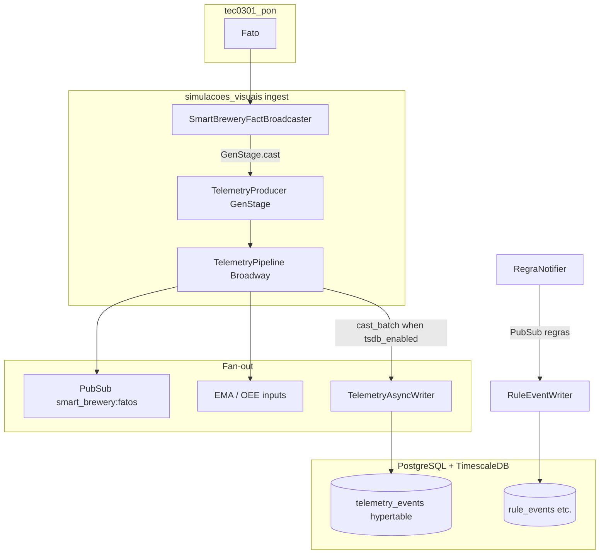

*If this helped you, you can [support the author with a coffee on dev.to](https://dev.to/matheuscamarques/support-with-a-coffee-2oa0).*

# From simulation to storage: telemetry, Broadway/GenStage, and TimescaleDB

**Part 7 of 12** — [Part 6 on dev.to — Phoenix LiveView in real time: an operations UI on top of a rules engine](https://dev.to/matheuscamarques/phoenix-liveview-in-real-time-an-operations-ui-on-top-of-a-rules-engine-17ci) · [repo draft](06_phoenix_liveview_operations_ui_rules_engine.md) showed how **LiveView** stays responsive: batched PubSub messages and a second throttle before touching assigns. This post goes **one layer deeper**: what happens when those same `Fato.atualizar/2` notifications must also become **durable rows** in PostgreSQL with the **TimescaleDB** extension—without blocking the rule processes or the UI.

We focus on the **`simulacoes_visuais`** Phoenix app: a **GenStage** producer, a **Broadway** pipeline with configurable batching, an asynchronous **GenServer** writer, and **hypertables** with retention. **Dimensional BI and Power BI** consumption are the subject of [**Part 8 on dev.to**](https://dev.to/matheuscamarques/bi-without-mystery-dimensions-facts-and-consuming-the-data-eg-power-bi-54aj).

---

## Why a separate persistence path?

The PON engine (`tec0301_pon`) is optimized for **reactive evaluation**: `Registry`, `Fato` processes, and rule notifications. Long-running `Repo.insert_all/3` calls do not belong on that hot path. The Phoenix application therefore acts as a **sink**, using the same back-pressure vocabulary as **GenStage** (demand-driven stages) and **Broadway** (batched consumers)—see the [GenStage](https://hexdocs.pm/gen_stage) and [Broadway](https://hexdocs.pm/broadway) documentation:

1. **Subscribe** to the engine’s notification bus (via `SmartBreweryFactBroadcaster`).
2. **Shape** traffic with back-pressure-friendly stages (GenStage + Broadway, with a GenServer fallback batcher).
3. **Publish** merged batches to PubSub for subscribers (EMA, OEE, downstream services).
4. **Persist** only when `:tsdb_enabled` is true, through a **queued async writer** so database latency does not stall the pipeline.

Running `mix run examples/smart_brewery_simulacao.exs` at the monorepo root still exercises **only** `:tec0301_pon`; it does **not** fill `telemetry_events`. Only this app, with TSDB enabled, owns the warehouse path—see [`apps/simulacoes_visuais/README.md`](../../apps/simulacoes_visuais/README.md).

---

## Turning the warehouse on: supervision and environment

At startup, `SimulacoesVisuais.Application` reads `SIMULACOES_TSDB_ENABLED` from the OS environment (falling back to `Application.get_env(:simulacoes_visuais, :tsdb_enabled, false)`). When enabled, it starts **`Repo`** plus dedicated writers **before** the HTTP endpoint:

```elixir
# apps/simulacoes_visuais/lib/simulacoes_visuais/application.ex (excerpt)
tsdb_children =
  if tsdb_enabled do
    [
      SimulacoesVisuais.Repo,
      SimulacoesVisuais.SmartBrewery.TelemetryAsyncWriter,
      SimulacoesVisuais.SmartBrewery.OeeSnapshotWriter,
      SimulacoesVisuais.SmartBrewery.AnomalyEventWriter,
      SimulacoesVisuais.SmartBrewery.RuleEventWriter
    ]
  else
    []
  end

children =
  [
    # … PubSub, bridge, TelemetryPipeline, batchers, Monte Carlo, …
    tsdb_children,
    SimulacoesVisuaisWeb.Endpoint
  ]
  |> List.flatten()
```

**Fact telemetry** flows through **`TelemetryPipeline`** (always started) and reaches `TelemetryAsyncWriter` only when the flag is on. **OEE, anomalies, and rule firings** use separate PubSub topics and writers that also depend on `Repo`.

Convenience in dev: `mix dev.tsdb` / `iex -S mix dev.tsdb` aligns with the README so Postgres/TimescaleDB and Monte Carlo can run together for local demos.

---

## GenStage producer: demand-driven ingest

`SmartBreweryFactBroadcaster` resolves the Broadway producer and sends `GenStage.cast(producer_pid, {:event, nome_fato, novo_valor})`. The producer keeps a bounded **queue**; when the queue is full, the oldest event is dropped—trading completeness for **bounded memory** under burst load.

Critically, when Broadway has already requested demand with an empty queue, `handle_cast/2` **drains immediately** so events are not stuck until the next `handle_demand`:

```elixir
# SimulacoesVisuais.SmartBrewery.TelemetryProducer (excerpt)
def handle_cast(
      {:event, nome_fato, valor},
      %{queue: queue, max_queue: max_queue, pending_demand: pending} = state
    ) do
  new_queue =
    if :queue.len(queue) >= max_queue do
      {{:value, _dropped}, tail} = :queue.out(queue)
      :queue.in({nome_fato, valor}, tail)
    else
      :queue.in({nome_fato, valor}, queue)
    end

  if pending > 0 do
    {events, drained_queue} = take_from_queue(new_queue, pending)
    new_pending = pending - length(events)
    {:noreply, events, %{state | queue: drained_queue, pending_demand: new_pending}}
  else
    {:noreply, [], %{state | queue: new_queue}}
  end
end
```

If the producer PID cannot be resolved, the broadcaster falls back to **`SmartBreweryTelemetryBatcher`**; that path must still call `TelemetryAsyncWriter.cast_batch/1` on flush so TSDB does not go silent while PubSub keeps working—a parity fix called out in the batcher’s moduledoc.

---

## Broadway: processors, batchers, and one merged batch

`TelemetryPipeline` uses Broadway’s **batcher** stage to merge many `{fact, value}` messages into a **single map** per batch (last write wins per key), then fan-out:

```elixir
# SimulacoesVisuais.SmartBrewery.TelemetryPipeline (excerpt)
Broadway.start_link(__MODULE__,
  name: __MODULE__,
  producer: [
    module: {TelemetryProducer, [name: :smart_brewery_telemetry_producer]},
    transformer: {__MODULE__, :transform, []}
  ],
  processors: [default: [concurrency: processor_concurrency]],
  batchers: [
    default: [
      concurrency: batcher_concurrency,
      batch_size: batch_size,
      batch_timeout: batch_timeout
    ]
  ]
)
```

```elixir
def handle_batch(:default, messages, _batch_info, _context) do
  if messages != [] do
    merged = messages |> merge_message_data(%{})
    list = Map.to_list(merged)

    :telemetry.execute(
      [:simulacoes_visuais, :smart_brewery_telemetry_batcher, :flush],
      %{updates_count: length(list), buffer_size_before: length(list)},
      %{}
    )

    Phoenix.PubSub.broadcast(SimulacoesVisuais.PubSub, "smart_brewery:fatos", {:batch, list})
    push_ema_numeric_loop(list)

    if Application.get_env(:simulacoes_visuais, :tsdb_enabled, false) do
      SimulacoesVisuais.SmartBrewery.TelemetryAsyncWriter.cast_batch(list)
    end
  end

  messages
end
```

So each batch: **metrics** (LiveDashboard can chart flush sizes), **PubSub** on `smart_brewery:fatos`, **EMA** updates for anomaly heuristics, and optionally **async persist**. [Part 6 on dev.to](https://dev.to/matheuscamarques/phoenix-liveview-in-real-time-an-operations-ui-on-top-of-a-rules-engine-17ci)’s LiveView listens on a **different** topic (`smart_brewery:liveview_batch`) fed by `LiveViewEventBatcher`—same simulation, two consumption speeds.

---

## TelemetryAsyncWriter: decouple DB latency from Broadway

`cast_batch/1` enqueues whole batches; a bounded queue drops the **oldest** batch when overloaded, keeping **recent** telemetry:

```elixir
# SimulacoesVisuais.SmartBrewery.TelemetryAsyncWriter (excerpt)
def cast_batch(list) when is_list(list) do
  GenServer.cast(__MODULE__, {:batch, list})
end

def handle_info(:flush, %{queue: [batch | rest]} = state) do
  persist(batch)
  Process.send_after(self(), :flush, 0)
  {:noreply, %{state | queue: rest}}
end

defp persist(list) do
  rows = SimulacoesVisuais.TelemetryEvent.changesets_from_batch(list)

  if rows != [] do
    SimulacoesVisuais.Repo.insert_all(SimulacoesVisuais.TelemetryEvent, rows)
    SimulacoesVisuais.SmartBrewery.PowerBIPushSink.cast_rows(rows)
  end
end
```

Broadway never waits on PostgreSQL; the writer serializes inserts and can hook optional push sinks for external analytics.

---

## Row shape: from Elixir values to columns

`TelemetryEvent.changesets_from_batch/2` maps `{atom_name, value}` tuples into flat maps suitable for `insert_all/3`—numbers as `value_float`, booleans split across `value_int` / `value_str`, other atoms as strings—so continuous aggregates and ML exports can choose the column that fits.

```elixir
# SimulacoesVisuais.TelemetryEvent (excerpt)
defp to_row(nome, valor, now) when is_number(valor) do
  %{
    ts: now,
    fact_name: Atom.to_string(nome),
    value_float: to_float(valor),
    value_int: nil,
    value_str: nil,
    inserted_at: now,
    updated_at: now
  }
end
```

---

## Rule events: same bus, different writer

Rule firings are published to `smart_brewery:regras` (for LiveView and others). **`RuleEventWriter`** subscribes, buffers up to a max pending count, and **`insert_all`** into `rule_events` in chunks—again isolating database work from the rule processes.

```elixir
# SimulacoesVisuais.SmartBrewery.RuleEventWriter (excerpt)
def handle_info({:regra, regra_id}, state) do
  pending = state.pending ++ [{:regra, regra_id}]
  # … trim to max_pending …
  Process.send_after(self(), :drain, 0)
  {:noreply, %{state | pending: pending, draining: true}}
end
```

OEE snapshots and anomaly rows follow the same pattern (dedicated modules in `SmartBrewery.*`).

---

## TimescaleDB: hypertable and retention

The initial migration enables the extension, creates `telemetry_events`, and promotes the table to a **hypertable** partitioned on `ts`, with a **7-day retention policy** on raw rows (adjustable in your deployment):

```elixir
# priv/repo/migrations/20250318000000_create_telemetry_events.exs (excerpt)
execute "CREATE EXTENSION IF NOT EXISTS timescaledb CASCADE;", ""

create table(:telemetry_events, primary_key: false) do
  add :ts, :utc_datetime_usec, null: false
  add :fact_name, :string, null: false
  add :value_float, :float
  add :value_int, :integer
  add :value_str, :string
  timestamps(type: :utc_datetime_usec)
end

execute "SELECT create_hypertable('telemetry_events', 'ts', if_not_exists => true);", ""
execute "SELECT add_retention_policy('telemetry_events', INTERVAL '7 days');", ""
```

Later migrations add **continuous aggregates** (for example `telemetry_events_1min`, hourly and daily rollups) and **compression** policies on the hypertable. Those objects sit entirely in the database: the Elixir app keeps writing **raw** `telemetry_events` rows; BI queries and `mix export.ml` can target either the base table or the CAGGs depending on grain and export flags (`--no-cagg`, `--no-cagg-1h-1day` in the Mix task help).

---

## Fallback batcher and TSDB parity

When the Broadway producer is unavailable, `SmartBreweryTelemetryBatcher` still merges updates and broadcasts `{:batch, list}` to `smart_brewery:fatos`. The flush handler mirrors the pipeline’s TSDB branch:

```elixir
if Application.get_env(:simulacoes_visuais, :tsdb_enabled, false) do
  SimulacoesVisuais.SmartBrewery.TelemetryAsyncWriter.cast_batch(list)
end
```

Without this, operators would still see PubSub-driven UI signals while **`telemetry_events` stayed flat**—a classic split-brain symptom when debugging ingest.

---

## End-to-end picture



---

## Operating and verifying

- **`mix verify.tsdb`** — checks extension, row counts, recent timestamps, and whether the Broadway producer and writers are alive.
- **Headless simulation** — `SIMULACOES_TSDB_ENABLED=true AUTO_START_MONTE_CARLO=true mix phx.server` (from the app directory) populates tables for ML export without opening the browser.
- **Retention** — `mix simulacoes_visuais.retention --days N` (from the `apps/simulacoes_visuais` directory, TSDB enabled) replaces the hypertable retention policy without editing migrations—the default migration still installs a 7-day window.

---

## Summary

[**Part 6 on dev.to**](https://dev.to/matheuscamarques/phoenix-liveview-in-real-time-an-operations-ui-on-top-of-a-rules-engine-17ci) optimized **perception** (UI). **This post** optimizes **durability**: GenStage demand, Broadway batching, bounded queues, async `insert_all`, and a time-series physical model. The engine stays reactive; the warehouse absorbs load on its own terms.

## References and further reading

- **Broadway** — batching, processors — [hexdocs.pm/broadway](https://hexdocs.pm/broadway).
- **GenStage** — producers/consumers, demand — [hexdocs.pm/gen_stage](https://hexdocs.pm/gen_stage).
- **TimescaleDB** — hypertables, continuous aggregates, retention — [docs.timescale.com](https://docs.timescale.com/).
- **Telemetry** — `telemetry` events in BEAM apps — [hexdocs.pm/telemetry](https://hexdocs.pm/telemetry).
- **In this repo** — [`application.ex`](../../apps/simulacoes_visuais/lib/simulacoes_visuais/application.ex), [`telemetry_pipeline.ex`](../../apps/simulacoes_visuais/lib/simulacoes_visuais/smart_brewery/telemetry_pipeline.ex), [`telemetry_producer.ex`](../../apps/simulacoes_visuais/lib/simulacoes_visuais/smart_brewery/telemetry_producer.ex), [`telemetry_async_writer.ex`](../../apps/simulacoes_visuais/lib/simulacoes_visuais/smart_brewery/telemetry_async_writer.ex), [`smart_brewery_telemetry_batcher.ex`](../../apps/simulacoes_visuais/lib/simulacoes_visuais/smart_brewery_telemetry_batcher.ex), migration [`20250318000000_create_telemetry_events.exs`](../../apps/simulacoes_visuais/priv/repo/migrations/20250318000000_create_telemetry_events.exs); [`docs/performance-dev.md`](../../performance-dev.md). Expanded list: [Bibliography on dev.to — PON + Smart Brewery series (EN drafts)](https://dev.to/matheuscamarques/bibliography-pon-smart-brewery-devto-series-en-drafts-58a9) · [repo draft](../BIBLIOGRAPHY_PON_SERIES.md).

---

**Published on dev.to:** [From simulation to storage: telemetry, Broadway/GenStage, and TimescaleDB](https://dev.to/matheuscamarques/from-simulation-to-storage-telemetry-broadwaygenstage-and-timescaledb-762) — tracked in [`docs/devto_serie_pon_smart_brewery.md`](../../devto_serie_pon_smart_brewery.md).

**Previous:** [Part 6 on dev.to — Phoenix LiveView in real time: an operations UI on top of a rules engine](https://dev.to/matheuscamarques/phoenix-liveview-in-real-time-an-operations-ui-on-top-of-a-rules-engine-17ci) · [repo draft](06_phoenix_liveview_operations_ui_rules_engine.md)  
**Next:** [Part 8 on dev.to — BI without mystery: dimensions, facts, and consuming the data (e.g. Power BI)](https://dev.to/matheuscamarques/bi-without-mystery-dimensions-facts-and-consuming-the-data-eg-power-bi-54aj) · [repo draft](08_bi_without_mystery_dimensions_facts_power_bi.md)
