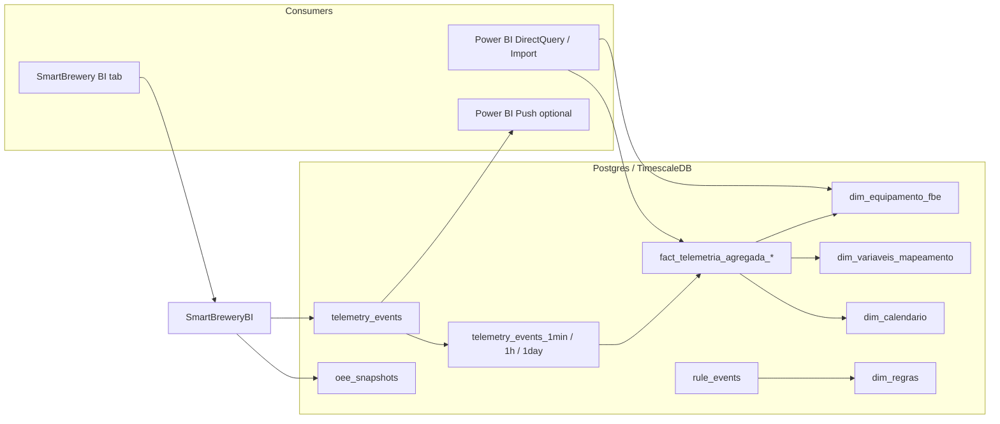

*If this helped you, you can [support the author with a coffee on dev.to](https://dev.to/matheuscamarques/support-with-a-coffee-2oa0).*

# BI without mystery: dimensions, facts, and consuming the data (e.g. Power BI)

**Part 8 of 12** — [Part 7 on dev.to — From simulation to storage: telemetry, Broadway/GenStage, and TimescaleDB](https://dev.to/matheuscamarques/from-simulation-to-storage-telemetry-broadwaygenstage-and-timescaledb-762) · [repo draft](07_from_simulation_to_storage_telemetry_broadway_timescaledb.md) landed **raw** rows in `telemetry_events` and sibling tables for OEE, anomalies, and rule firings. Analysts rarely want fifty-seven wide columns per millisecond; they want a **model** they can relate in a semantic layer and refresh on a schedule—or query live with guardrails.

This post describes the **star-style** objects in the Smart Brewery Postgres/Timescale database, how **`SimulacoesVisuais.SmartBreweryBI`** mirrors those queries for the in-app **BI** tab, and how **Power BI** (or any SQL BI tool) can connect safely. [**Part 9 on dev.to**](https://dev.to/matheuscamarques/ml-on-the-digital-twin-export-train-pilots-and-import-predictions-back-into-the-app-207i) picks up **ML exports and prediction round-trips**. The dimensional vocabulary—**facts** vs **dimensions**, conformed keys, slowly changing attributes—follows the Kimball-style methodology (*The Data Warehouse Toolkit*, 3rd ed., Wiley); our schema is a pragmatic subset for a twin demo, not a full enterprise bus matrix.

---

## Why not query only `telemetry_events`?

The hypertable is the source of truth for **high-volume** numeric telemetry. For dashboards you usually:

1. **Bucket** time with `time_bucket` (TimescaleDB).
2. **Aggregate** (`avg`, `min`, `max`) per bucket and signal.
3. **Join** to **dimensions** so charts show “Fermentador A” instead of `fbe_06_internal_temp`.

Continuous aggregates (`telemetry_events_1min`, `_1h`, `_1day`) precompute that roll-up. Views on top expose a **fact** shape with `fbe_id` and `fact_name` ready for foreign-key-style relationships in Power BI.

---

## Dimension tables: equipment and variables

The migration seeds two conformed dimensions used across reports:

```elixir
# priv/repo/migrations/20250319200000_add_star_schema_dimensions_and_fact_views.exs (excerpt)
create table(:dim_equipamento_fbe, primary_key: false) do
  add :fbe_id, :string, primary_key: true
  add :nome, :string, null: false
  add :fase_operacional, :string
end

# INSERT … FBE_01 … FBE_11 with Portuguese operational labels

create table(:dim_variaveis_mapeamento, primary_key: false) do
  add :fact_name, :string, primary_key: true
  add :descricao, :string, null: false
  add :unidade, :string
end

# INSERT … maps each fbe_XX_* fact atom string to human description + unit
```

A later migration adds **`descricao_longa`** (aligned with `FatoDescriptions`) and **`dim_regras`**: metadata for PON rules (`r_01` … `r_12`) so `rule_events` can be explained in plain language—see [`20260320140000_power_bi_dim_context.exs`](../../apps/simulacoes_visuais/priv/repo/migrations/20260320140000_power_bi_dim_context.exs).

---

## Calendar dimension and fact views

`dim_calendario` is built from **distinct buckets** of the 1-minute continuous aggregate—useful for time-intelligence style filters without scanning the full hypertable:

```sql
-- From the same migration (conceptual shape)
CREATE VIEW dim_calendario AS
SELECT DISTINCT
  bucket AS ts_bucket,
  date_trunc('day', bucket)::timestamptz AS dt,
  EXTRACT(YEAR FROM bucket)::int AS year,
  EXTRACT(MONTH FROM bucket)::int AS month,
  ...
FROM telemetry_events_1min;
```

Fact views project CAGG columns into a stable star join key:

```sql
CREATE VIEW fact_telemetria_agregada_1min AS
SELECT bucket AS ts_bucket,
  UPPER(SUBSTRING(fact_name FROM 1 FOR 7)) AS fbe_id,
  fact_name,
  value_float_avg AS avg_value,
  value_float_min AS min_value,
  value_float_max AS max_value
FROM telemetry_events_1min;
```

Parallel views exist for **`_1h`** and **`_1day`** grains. In Power BI, typical relationships are: fact → `dim_equipamento_fbe` on `fbe_id`, fact → `dim_variaveis_mapeamento` on `fact_name`, fact → `dim_calendario` on `ts_bucket`.

**CAGG latency vs freshness:** Continuous aggregates refresh on a policy schedule (see migrations under `priv/repo/migrations` for `telemetry_events_1min` and friends). That is ideal for **import** or **DirectQuery** models that scan fewer rows per question. When operators need charts that track the last minutes without waiting for the next rollup refresh, `SmartBreweryBI` hits **`telemetry_events`** directly with `time_bucket`—same SQL idioms, different freshness/cost trade-off.

**Practical note:** `rule_events.regra_id` is persisted as the string form of the numeric rule id (e.g. `"1"`). `dim_regras` uses keys like `"r_01"`. For joins you may add a calculated column or a small bridge in SQL—worth standardizing in one place for your deployment.

**Offline analytics:** `mix export.ml` (with TSDB enabled) emits CSV slices of telemetry, OEE, anomalies, rules, and dimension tables—useful for Python/R notebooks or training pipelines before [**Part 9 on dev.to**](https://dev.to/matheuscamarques/ml-on-the-digital-twin-export-train-pilots-and-import-predictions-back-into-the-app-207i)’s prediction import path.

---

## Event facts beside telemetry

Telemetry is only one analytical slice. The same database holds **`oee_snapshots`** (availability / performance / quality components over time), **`anomaly_events`** (EMA-driven highlights aligned with the operator UI), and **`rule_events`** (which PON rule fired, with optional **`case_id`** for scenario tracking). None of these replace the star views—they **complement** them: a single Power BI report can place OEE line charts next to aggregated temperature trends and a table of recent rule firings, all filtered by the same time slicer on `ts`.

---

## Native BI in Elixir: `SmartBreweryBI`

The Phoenix app does not require Power BI for demos. **`SmartBreweryBI`** centralizes parameterized SQL: OEE cards, telemetry trends with `time_bucket`, correlation pivots, synoptic averages by FBE, anomaly Pareto, and rule counts.

```elixir
# SimulacoesVisuais.SmartBreweryBI (excerpt)
def default_filters do
  %{
    "window" => "24h",
    "granularity" => "1h",
    "fbe_id" => "all",
    "fact_name" => "all"
  }
end

def dashboard_data(filters) do
  filters = normalize_filters(filters)
  hours = window_to_hours(filters["window"])

  %{
    oee_cards: oee_cards(hours),
    oee_trend: oee_trend(hours, filters["granularity"]),
    telemetry_trend: telemetry_trend(filters, hours),
    cep_chart: cep_chart(filters, hours),
    correlation_points: correlation_points(filters, hours),
    synoptic_status: synoptic_status(hours),
    anomaly_pareto: anomaly_pareto(hours),
    rule_top: rule_top(hours),
    totals: totals(hours)
  }
end
```

The **BI** view mode in `SmartBreweryLive` ([Part 6 on dev.to](https://dev.to/matheuscamarques/phoenix-liveview-in-real-time-an-operations-ui-on-top-of-a-rules-engine-17ci)) loads this map when `:tsdb_enabled` is true—same warehouse, two consumers (LiveView vs external BI).

For **near-real-time** trends, the module prefers querying **`telemetry_events`** with `time_bucket` for selected panels so results are not delayed by CAGG refresh policies; aggregated **views** remain the sweet spot for heavier report workloads.

---

## Governance: read-only database role

The migration **`AddPowerbiAnalyticsReadonlyRole`** creates **`powerbi_analytics`**: `LOGIN`, `CONNECT` to the database, `USAGE` on `public`, **`SELECT`** on tables and default privileges for future tables. The BI connector should **not** use the application superuser.

```elixir
# Excerpt from 20250319400000_add_powerbi_analytics_readonly_role.exs
execute format('CREATE ROLE powerbi_analytics WITH LOGIN PASSWORD %L', '#{escaped}')
execute "GRANT USAGE ON SCHEMA public TO powerbi_analytics;"
execute "GRANT SELECT ON ALL TABLES IN SCHEMA public TO powerbi_analytics;"
execute "ALTER DEFAULT PRIVILEGES IN SCHEMA public GRANT SELECT ON TABLES TO powerbi_analytics;"
```

Set **`POWERBI_ANALYTICS_PASSWORD`** before migrating in real environments.

---

## Optional: push rows to Power BI REST

When Import/DirectQuery is not enough for a “live tile” experiment, **`PowerBIPushSink`** can enqueue rows **after** they are persisted, throttle HTTP calls, and POST to the [Push datasets API](https://learn.microsoft.com/en-us/rest/api/power-bi/push-datasets). It is **off by default** (`:power_bi_push` → `enabled: false`).

```elixir
# SimulacoesVisuais.SmartBrewery.PowerBIPushSink — encode_row/2 (excerpt)
defp encode_row(%{ts: ts, fact_name: fact_name, value_float: vf, value_int: vi, value_str: vs}, opts) do
  fact_str = to_string(fact_name)

  base = %{
    "ts" => datetime_to_iso8601(ts),
    "fact_name" => fact_str,
    "value_float" => vf,
    "value_int" => vi,
    "value_str" => vs
  }

  if Keyword.get(opts, :include_labels, true) do
    desc = SimulacoesVisuais.SmartBrewery.FatoDescriptions.descricao_bin(fact_str)
    Map.put(base, "descricao", desc)
  else
    base
  end
end
```

Operational guidance (latency vs license, DirectQuery vs push) lives in **[`docs/power-bi-realtime.md`](../../docs/power-bi-realtime.md)** at the repo root.

---

## Verify the model: `mix verify.bi`

The Mix task runs **`SmartBreweryBI.run_query_diagnostics/0`**: each diagnostic query returns `:ok` with a small `LIMIT` sample, or an error you can fix before publishing reports.

```bash
# From apps/simulacoes_visuais (TSDB enabled)
mix verify.bi
# alias: mix simulacoes_visuais.verify_bi_queries
```

Zero rows in a sample is still **success** if your simulation was off—the README stresses distinguishing “query broken” from “empty time window”.

---

## Architecture sketch



---

## Summary

[**Part 7 on dev.to**](https://dev.to/matheuscamarques/from-simulation-to-storage-telemetry-broadwaygenstage-and-timescaledb-762) wrote fast **facts**; **this post** makes them **legible**: conformed dimensions, CAGG-backed fact views, a read-only role, optional push, and a single Elixir module that encodes the same SQL the UI and `mix verify.bi` rely on. Next, we close the loop with **ML** on top of these exports ([**Part 9 on dev.to**](https://dev.to/matheuscamarques/ml-on-the-digital-twin-export-train-pilots-and-import-predictions-back-into-the-app-207i)).

## References and further reading

- **Kimball, R.; Ross, M.** — *The Data Warehouse Toolkit* (3rd ed.) — dimensional modeling, star schema, fact/grain discipline (Wiley).
- **TimescaleDB** — continuous aggregates as rollups — [docs.timescale.com](https://docs.timescale.com/use-timescale/latest/continuous-aggregates/).
- **Microsoft Learn** — Power BI REST / [push datasets](https://learn.microsoft.com/en-us/rest/api/power-bi/push-datasets) (see also in-repo [`power-bi-realtime.md`](../../docs/power-bi-realtime.md)).
- **PostgreSQL** — roles, `GRANT`, least privilege — [documentation](https://www.postgresql.org/docs/current/sql-grant.html).
- **In this repo** — [`smart_brewery_bi.ex`](../../apps/simulacoes_visuais/lib/simulacoes_visuais/smart_brewery_bi.ex), [`power_bi_push_sink.ex`](../../apps/simulacoes_visuais/lib/simulacoes_visuais/smart_brewery/power_bi_push_sink.ex), migrations [`20250319200000_add_star_schema_dimensions_and_fact_views.exs`](../../apps/simulacoes_visuais/priv/repo/migrations/20250319200000_add_star_schema_dimensions_and_fact_views.exs), [`20250319400000_add_powerbi_analytics_readonly_role.exs`](../../apps/simulacoes_visuais/priv/repo/migrations/20250319400000_add_powerbi_analytics_readonly_role.exs). Expanded list: [Bibliography on dev.to — PON + Smart Brewery series (EN drafts)](https://dev.to/matheuscamarques/bibliography-pon-smart-brewery-devto-series-en-drafts-58a9) · [repo draft](../BIBLIOGRAPHY_PON_SERIES.md).

---

**Published on dev.to:** [BI without mystery: dimensions, facts, and consuming the data (e.g. Power BI)](https://dev.to/matheuscamarques/bi-without-mystery-dimensions-facts-and-consuming-the-data-eg-power-bi-54aj) — tracked in [`docs/devto_serie_pon_smart_brewery.md`](../../devto_serie_pon_smart_brewery.md).

**Previous:** [Part 7 on dev.to — From simulation to storage: telemetry, Broadway/GenStage, and TimescaleDB](https://dev.to/matheuscamarques/from-simulation-to-storage-telemetry-broadwaygenstage-and-timescaledb-762) · [repo draft](07_from_simulation_to_storage_telemetry_broadway_timescaledb.md)  
**Next:** [Part 9 on dev.to — ML on the digital twin: export, train pilots, and import predictions back into the app](https://dev.to/matheuscamarques/ml-on-the-digital-twin-export-train-pilots-and-import-predictions-back-into-the-app-207i) · [repo draft](09_ml_digital_twin_export_train_import_predictions.md)
