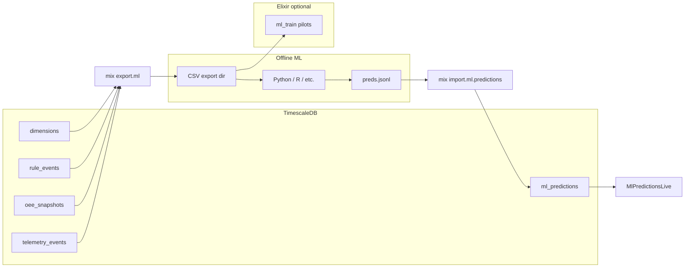

*If this helped you, you can [support the author with a coffee on dev.to](https://dev.to/matheuscamarques/support-with-a-coffee-2oa0).*

# ML on the digital twin: export, train pilots, and import predictions back into the app

**Part 9 of 12** — [Part 8 on dev.to — BI without mystery: dimensions, facts, and consuming the data (e.g. Power BI)](https://dev.to/matheuscamarques/bi-without-mystery-dimensions-facts-and-consuming-the-data-eg-power-bi-54aj) · [repo draft](08_bi_without_mystery_dimensions_facts_power_bi.md) gave you a **star-shaped** analytical surface in PostgreSQL/TimescaleDB. Machine learning needs the same history in **files** or **arrays**, then a path to bring **scores** back where operators already look: the Phoenix app.

This post covers **`mix export.ml`**, the **CSV contract** documented in `MLDatasetExport`, **in-Beam pilot trainers** (`mix simulacoes_visuais.ml_train`), **batch import** of predictions as JSONL, and the **`/smart-brewery/ml-predictions`** LiveView. [**Part 10 on dev.to**](https://dev.to/matheuscamarques/when-notifications-explode-message-storms-deduplication-and-back-pressure-in-pon-34p4) shifts to **message storms** and back-pressure in the PON engine.

For a longer Portuguese walkthrough (notebooks, Python sketches), see [`docs/artigos/27_guia_pratico_treino_ml_smart_brewery.md`](../../artigos/27_guia_pratico_treino_ml_smart_brewery.md).

---

## Closed loop in three hops

1. **Export** — Snapshot telemetry, OEE, anomalies, rule events, dimensions, and optional CAGG slices to a directory of CSVs.
2. **Train / infer offline** — Use Elixir pilots for demos, or Python/R/Julia on the same files; produce **JSON Lines** (one JSON object per row).
3. **Import + display** — `mix import.ml.predictions` (alias) bulk-inserts into **`ml_predictions`**; **`MlPredictionsLive`** lists recent rows.

Training itself is intentionally **out of band**: the app does not need GPU drivers to be valuable as the **system of record** for predictions. For **production readiness** checklists (monitoring, data validation, CI for models), Google’s *ML Test Score* rubric is a compact reference ([Breck et al., 2017](https://research.google/pubs/pub46555/)); this repo implements only a **thin** slice—export/import contracts and a LiveView reader—not full MLOps.

---

## Step 1: `mix export.ml`

From `apps/simulacoes_visuais`, with **`:tsdb_enabled`** and migrations applied:

```bash
mix export.ml --out /tmp/ml_export --since-hours 168
# Long form: mix simulacoes_visuais.export_ml --out /tmp/ml_export --since-hours 72
# Skip some CAGGs if missing: --no-cagg or --no-cagg-1h-1day
```

The task delegates to **`SimulacoesVisuais.MLDatasetExport.export_all/2`**, which writes UTF-8 CSVs with headers. The module’s moduledoc is the **contract** for downstream notebooks—example excerpts:

```elixir
# SimulacoesVisuais.MLDatasetExport @moduledoc (SQL shapes, excerpt)
# Telemetry (multivariate series)
#   SELECT ts, fact_name, value_float, value_int, value_str, ...
#   FROM telemetry_events WHERE ts >= $1 ORDER BY ts ASC;
# OEE (regression target)
#   SELECT ts, oee_pct, availability_pct, performance_pct, quality_pct, ...
#   FROM oee_snapshots WHERE ts >= $1 ORDER BY ts ASC;
# Rule firings (discrete events)
#   SELECT ts, regra_id, case_id, ... FROM rule_events WHERE ts >= $1 ...
# Dimensions + telemetry_events_1min / _1h / _1day — see source for full SQL.
```

Typical filenames include `telemetry_events.csv`, `oee_snapshots.csv`, `rule_events.csv`, `dim_equipamento_fbe.csv`, and CAGG exports—matching the README’s **headless simulation** story (Docker Postgres, Monte Carlo, then export).

The same migration that introduced **`ml_predictions`** also adds **`case_id`** to **`rule_events`**, so exported rule traces can align with **process-mining** style case identifiers when you join predictions back to operational event logs.

---

## Step 2a: Elixir pilots (Scholar / Axon)

For reproducible demos without leaving the BEAM, **`mix simulacoes_visuais.ml_train`** reads the same CSV directory:

```bash
mix simulacoes_visuais.ml_train --dir /tmp/ml_export --pilot oee
mix simulacoes_visuais.ml_train --dir /tmp/ml_export --pilot fermentation --epochs 40
mix simulacoes_visuais.ml_train --dir /tmp/ml_export --pilot anomaly --epochs 40
```

- **`oee`** — Scholar **linear regression** baseline on exported OEE series.
- **`fermentation`** — **Axon MLP** pilot on fermentation-related signals.
- **`anomaly`** — **Axon autoencoder** focused on FBE_01-style vibration features.

The task prints **metrics** to the shell; production workflows usually **emit JSONL** from a separate inference job and import below.

---

## Step 2b: JSONL format for import

Each line is a JSON object. **`model_name`** is required; **`ts`** is optional (defaults to “now” in UTC, normalized to microsecond precision for Ecto).

```json
{"model_name":"oee_linear_v1","ts":"2025-03-20T12:00:00.000000Z","target_name":"oee_pct","value_float":87.4,"metadata":{"rmse":2.1,"export_window_h":168}}
```

Optional fields: **`target_name`**, **`value_float`**, **`metadata`** (object, stored as JSON in Postgres).

---

## Step 3: persist predictions — schema and context

The migration creates a narrow **fact table** for batch scores:

```elixir
# priv/repo/migrations/20260319120000_add_rule_events_case_id_and_ml_predictions.exs (excerpt)
create table(:ml_predictions, primary_key: false) do
  add :id, :binary_id, primary_key: true
  add :ts, :utc_datetime_usec, null: false
  add :model_name, :string, null: false
  add :target_name, :string
  add :value_float, :float
  add :metadata, :map
  timestamps(type: :utc_datetime_usec)
end

create index(:ml_predictions, [:ts])
create index(:ml_predictions, [:model_name, :ts])
```

```elixir
# SimulacoesVisuais.MlPrediction (schema excerpt)
@primary_key {:id, :binary_id, autogenerate: true}
schema "ml_predictions" do
  field(:ts, :utc_datetime_usec)
  field(:model_name, :string)
  field(:target_name, :string)
  field(:value_float, :float)
  field(:metadata, :map)
  timestamps(type: :utc_datetime_usec)
end
```

Bulk insert from decoded JSON maps:

```elixir
# SimulacoesVisuais.MlPredictions.insert_from_decoded_maps/1 (excerpt)
# Each map must include "model_name"; missing model raises ArgumentError.
rows =
  Enum.map(maps, fn m ->
    m = Map.new(m, fn {k, v} -> {to_string(k), v} end)
    %{
      id: Ecto.UUID.generate(),
      ts: parse_ts(m["ts"]) || now,
      model_name: m["model_name"],
      target_name: m["target_name"],
      value_float: m["value_float"],
      metadata: m["metadata"] || %{},
      inserted_at: now,
      updated_at: now
    }
  end)

{n, _} = Repo.insert_all(MlPrediction, rows)
{:ok, n}
```

---

## Mix task: import from disk

```elixir
# mix simulacoes_visuais.ml_import_predictions @moduledoc (usage)
#   mix simulacoes_visuais.ml_import_predictions --file /path/to/preds.jsonl
# Alias in mix.exs: mix import.ml.predictions --file /path/to/preds.jsonl
```

The task streams the file, **`Jason.decode!/1`** per line, and calls **`MlPredictions.insert_from_decoded_maps/1`**. It requires **`:tsdb_enabled`** so `Repo` is part of the running app configuration you expect in TSDB workflows.

---

## LiveView: `/smart-brewery/ml-predictions`

```elixir
# SimulacoesVisuaisWeb.MlPredictionsLive — mount/3 (excerpt)
def mount(_params, _session, socket) do
  {preds, tsdb?} = load_predictions()
  {:ok, assign(socket, predictions: preds, tsdb_enabled: tsdb?)}
end

defp load_predictions do
  tsdb? = Application.get_env(:simulacoes_visuais, :tsdb_enabled, false)

  preds =
    if tsdb? do
      SimulacoesVisuais.MlPredictions.list_recent(100)
    else
      []
    end

  {preds, tsdb?}
end
```

Router (already introduced in [Part 6 on dev.to](https://dev.to/matheuscamarques/phoenix-liveview-in-real-time-an-operations-ui-on-top-of-a-rules-engine-17ci)):

```elixir
live "/smart-brewery/ml-predictions", MlPredictionsLive, :index
```

The template surfaces **timestamp**, **model**, **target**, and **value**, plus a **Refresh** button—enough to validate that your batch job actually landed in the warehouse.

---

## Flow diagram



---

## Summary

[**Part 7 on dev.to**](https://dev.to/matheuscamarques/from-simulation-to-storage-telemetry-broadwaygenstage-and-timescaledb-762) and [**Part 8 on dev.to**](https://dev.to/matheuscamarques/bi-without-mystery-dimensions-facts-and-consuming-the-data-eg-power-bi-54aj) built and modeled **historical plant data**. **This post** completes the ML ergonomics: **standard CSV exports**, **documented SQL**, **optional BEAM-native pilots**, a **simple import contract**, and a **LiveView** to read `ml_predictions`. Next: keeping the **notification graph** healthy when rates spike ([**Part 10 on dev.to**](https://dev.to/matheuscamarques/when-notifications-explode-message-storms-deduplication-and-back-pressure-in-pon-34p4)).

## References and further reading

- **Breck et al. (2017)** — *The ML Test Score* — [Google Research](https://research.google/pubs/pub46555/) (production-readiness rubric; not a tutorial).
- **Axon / Scholar** — neural and classical ML in Elixir — [hexdocs.pm/axon](https://hexdocs.pm/axon), [hexdocs.pm/scholar](https://hexdocs.pm/scholar).
- **In this repo (PT)** — [`docs/artigos/27_guia_pratico_treino_ml_smart_brewery.md`](../../artigos/27_guia_pratico_treino_ml_smart_brewery.md).
- **In this repo (code)** — [`export_ml` task](../../apps/simulacoes_visuais/mix/tasks/simulacoes_visuais.export_ml.ex), [`ml_dataset_export.ex`](../../apps/simulacoes_visuais/lib/simulacoes_visuais/ml_dataset_export.ex), [`ml_train` task](../../apps/simulacoes_visuais/mix/tasks/simulacoes_visuais.ml_train.ex), [`ml_import_predictions` task](../../apps/simulacoes_visuais/mix/tasks/simulacoes_visuais.ml_import_predictions.ex), [`ml_predictions.ex`](../../apps/simulacoes_visuais/lib/simulacoes_visuais/ml_predictions.ex), [`ml_predictions_live.ex`](../../apps/simulacoes_visuais/lib/simulacoes_visuais_web/live/ml_predictions_live.ex). Expanded list: [Bibliography on dev.to — PON + Smart Brewery series (EN drafts)](https://dev.to/matheuscamarques/bibliography-pon-smart-brewery-devto-series-en-drafts-58a9) · [repo draft](../BIBLIOGRAPHY_PON_SERIES.md).

---

**Published on dev.to:** [ML on the digital twin: export, train pilots, and import predictions back into the app](https://dev.to/matheuscamarques/ml-on-the-digital-twin-export-train-pilots-and-import-predictions-back-into-the-app-207i) — tracked in [`docs/devto_serie_pon_smart_brewery.md`](../../devto_serie_pon_smart_brewery.md).

**Previous:** [Part 8 on dev.to — BI without mystery: dimensions, facts, and consuming the data (e.g. Power BI)](https://dev.to/matheuscamarques/bi-without-mystery-dimensions-facts-and-consuming-the-data-eg-power-bi-54aj) · [repo draft](08_bi_without_mystery_dimensions_facts_power_bi.md)  
**Next:** [Part 10 on dev.to — When notifications explode: message storms, deduplication, and back-pressure in PON](https://dev.to/matheuscamarques/when-notifications-explode-message-storms-deduplication-and-back-pressure-in-pon-34p4) · [repo draft](10_when_notifications_explode_message_storms_pon.md)
