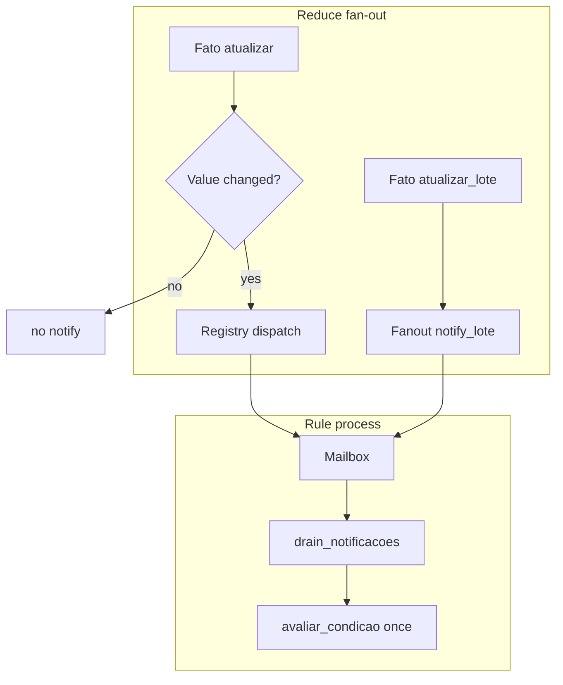

*If this helped you, you can [support the author with a coffee on dev.to](https://dev.to/matheuscamarques/support-with-a-coffee-2oa0).*

# When notifications explode: message storms, deduplication, and back-pressure in PON

**Part 10 of 12** — [Part 9 on dev.to — ML on the digital twin: export, train pilots, and import predictions back into the app](https://dev.to/matheuscamarques/ml-on-the-digital-twin-export-train-pilots-and-import-predictions-back-into-the-app-207i) · [repo draft](09_ml_digital_twin_export_train_import_predictions.md) showed how to **export** history and **import** model scores. Before adding more consumers, it pays to ask: what happens when the twin’s **tick rate** rises and every `Fato.atualizar/2` fans out to many `Regra` processes?

This post is about **message storms** on the BEAM: redundant `Registry.dispatch` work, rule mailboxes full of duplicate context, and **back-pressure** at the edges. The patterns below are implemented in **`tec0301_pon`** and exercised by **Smart Brewery** + **`simulacoes_visuais`**. Deeper Portuguese notes live in [`docs/artigos/19_mitigacao_message_storm_pon_elixir_smart_brewery.md`](../../artigos/19_mitigacao_message_storm_pon_elixir_smart_brewery.md); reproducing profiles is covered in [`docs/performance-dev.md`](../../performance-dev.md). [**Part 11 on dev.to**](https://dev.to/matheuscamarques/dev-profiling-cpu-memory-and-what-changed-after-optimizations-28hb) zooms in on **profiling** methodology and before/after numbers. Intuitively, **stable** queueing systems obey **Little’s Law** (mean work in system ∝ arrival rate × mean delay—[Little 1961](https://en.wikipedia.org/wiki/Little%27s_law)); storms push the “work in system” term through the roof unless you cut redundant arrivals or widen the bottleneck.

---

## Symptom: CPU spent orchestrating, not deciding

In actor-style PON graphs, one fact update can mean:

1. A **`GenServer`** cast on the fact process.
2. **`Registry.dispatch`** to every subscriber.
3. One **message per rule** that watches the fact.
4. **Condition evaluation** and possibly actions—again per message.

Under Monte Carlo or dense PLC simulation, steps 2–3 multiply into a **storm**: schedulers stay busy copying terms between processes, even when the **business outcome** would be the same after coalescing updates.

---

## 1. Deduplicate at the source (`Fato`)

If the new value is **strictly equal** to the current one (`===`), skip dispatch entirely and do not bump the fact’s notification statistics:

```elixir
# lib/tec0301_pon/pon/fato.ex — handle_cast/2 (excerpt)
def handle_cast({:atualizar, novo_valor}, estado) do
  if valor_igual?(estado.valor, novo_valor) do
    {:noreply, estado}
  else
    novo_estado =
      estado
      |> Map.update(:estatisticas, 1, &(&1 + 1))
      |> Map.put(:valor, novo_valor)

    ets_put(estado.nome, novo_valor)

    Registry.dispatch(Tec0301Pon.PON.PubSub, estado.nome, fn inscritos ->
      for {pid, _} <- inscritos, do: send(pid, {:notificacao, estado.nome, novo_valor})
    end)

    {:noreply, novo_estado}
  end
end
```

**Float note:** equality is exact. Noisy floats should be **quantized** upstream (as in the Smart Brewery random walk) if you rely on this filter—adding a global epsilon for all types would surprise rules that compare structured terms.

---

## 2. Coalesce across facts (`Fanout` + `atualizar_lote/1`)

Correlated equipment often updates **several** facts in the same tick (e.g. filter pressure, clarity, pump speed). Calling `atualizar/2` three times means three dispatches and three bursts to shared rules. **`Fato.atualizar_lote/1`** applies **`{:atualizar_sem_dispatch, val}`** per changed fact, then sends **one** `{:notificacoes_lote, map}` per subscriber PID:

```elixir
# lib/tec0301_pon/pon/fanout.ex — notify_lote/1 (excerpt)
defp notify_lote(changed) when is_map(changed) do
  pids =
    changed
    |> Map.keys()
    |> Enum.flat_map(fn key ->
      Registry.lookup(@pubsub, key) |> Enum.map(fn {pid, _} -> pid end)
    end)
    |> Enum.uniq()

  msg = {:notificacoes_lote, changed}
  Enum.each(pids, fn pid -> send(pid, msg) end)
end
```

Rules merge only the keys they watch:

```elixir
# lib/tec0301_pon/pon/regra.ex — after {:notificacoes_lote, updates}
relevante = Map.take(updates, estado.fatos)
nova_memoria = Map.merge(estado.memoria, relevante)
{nova_memoria, drained} = drain_notificacoes(nova_memoria, estado, 0)
# then update :estatisticas_notificacoes and call avaliar_apos_memoria/2
```

Large batches use **`Task.async_stream`** with bounded concurrency inside `Fanout.atualizar_lote/1`; very small maps update sequentially—see the module for thresholds.

---

## 3. Drain the rule mailbox before evaluating (`drain_notificacoes/3`)

Even with fan-out reduced, bursts still happen. After applying the first notification, **`Regra`** empties the mailbox of **more** `{:notificacao, …}` / `{:notificacoes_lote, …}` with a zero-timeout `receive`, then runs **one** `avaliar_condicao/2`:

```elixir
# lib/tec0301_pon/pon/regra.ex — drain (excerpt)
defp drain_notificacoes(memoria, estado, acc) do
  receive do
    {:notificacao, nome, valor} ->
      drain_notificacoes(Map.put(memoria, nome, valor), estado, acc + 1)

    {:notificacoes_lote, upd} when is_map(upd) ->
      rel = Map.take(upd, estado.fatos)
      drain_notificacoes(Map.merge(memoria, rel), estado, acc + 1)
  after
    0 ->
      {memoria, acc}
  end
end
```

This is **debounce-by-draining**: the rule sees the **latest** memory state for the burst window, not every intermediate message.

---

## 4. Fast reads without blocking the fact (`ETS`)

Hot paths that only need the current value (e.g. filling rule memory, Monte Carlo readers) call **`Fato.obter/1`**, which prefers a public **ETS** table with `read_concurrency` and `write_concurrency`:

```elixir
# lib/tec0301_pon/pon/fato.ex — obter/1 (excerpt)
def obter(nome_do_fato) when is_atom(nome_do_fato) do
  case :ets.lookup(@ets_table, nome_do_fato) do
    [{^nome_do_fato, valor}] -> valor
    [] -> GenServer.call(nome_do_fato, :obter)
  end
end
```

`Tec0301Pon.Application` calls **`Fato.ensure_ets!()`** before registering the `Registry` so lookups are safe during startup races.

---

## 5. Back-pressure outside the engine (Phoenix / Broadway)

The PON core is not the only fan-out. **`SmartBreweryFactBroadcaster`**, **`LiveViewEventBatcher`**, **`TelemetryProducer`** (bounded queue with drop-oldest), and **Broadway** batchers implement **pressure** so PostgreSQL and LiveView do not amplify storms—see [Part 6 on dev.to](https://dev.to/matheuscamarques/phoenix-liveview-in-real-time-an-operations-ui-on-top-of-a-rules-engine-17ci) · [repo draft](06_phoenix_liveview_operations_ui_rules_engine.md) and [Part 7 on dev.to](https://dev.to/matheuscamarques/from-simulation-to-storage-telemetry-broadwaygenstage-and-timescaledb-762) · [repo draft](07_from_simulation_to_storage_telemetry_broadway_timescaledb.md). **`SmartBreweryMonteCarlo`** caches `Application.get_env` bounds in **`init`** so the tick loop does not hit the application environment on every iteration.

---

## Message contract cheat sheet

| Message | Typical producer | Consumer |
|--------|------------------|----------|
| `{:notificacao, name, value}` | `Fato` after a real change | Rules, telemetry bridge |
| `{:notificacoes_lote, %{atom => value}}` | `Fanout.notify_lote/1` | Same subscribers; rules `Map.take/2` relevant keys |

Code that only ever calls **`atualizar/2`** keeps the single-notification shape; simulation paths that batch use **`atualizar_lote/1`**.

---

## Measuring (preview — full walkthrough in [Part 11 on dev.to](https://dev.to/matheuscamarques/dev-profiling-cpu-memory-and-what-changed-after-optimizations-28hb))

The repo ships **`SimulacoesVisuais.Profile.PipelineWorkload`** and Mix tasks such as **`mix profile.cprof`** for repeatable runs. Example harness (TSDB off, headless):

```bash
cd apps/simulacoes_visuais
mkdir -p tmp/profile
PROFILE_PIPELINE_DURATION_MS=60000 LOGGER_LEVEL=warning \
  SIMULACOES_TSDB_ENABLED=false SIMULACOES_HEADLESS=true \
  mix profile.cprof -e "SimulacoesVisuais.Profile.PipelineWorkload.run()" \
  | tee tmp/profile/cprof-sample.txt
```

Treat **percent gains** as **hypotheses** until you A/B the same workload on two commits; the internal article avoids advertising fixed “30–50%” without paired measurements.

---

## Flow diagram



---

## Summary

**Message storms** are a property of **graph fan-out**, not a judgment on PON. This codebase mitigates them with **deduplication**, **batch notifications**, **mailbox draining**, **ETS reads**, and **bounded** telemetry pipelines—without changing what a rule *means*, only how often it is prodded. [**Part 11 on dev.to**](https://dev.to/matheuscamarques/dev-profiling-cpu-memory-and-what-changed-after-optimizations-28hb) ties these knobs to **profiles** and memory heuristics.

## References and further reading

- **Little, J. D. C. (1961)** — *A proof for the queuing formula L = λW* — classic **Little’s Law**; [Wikipedia entry](https://en.wikipedia.org/wiki/Little%27s_law) with citation to *Operations Research*.
- **Erlang** — `:erlang.process_info/2` (mailbox length, etc.) — [manual](https://www.erlang.org/doc/man/erlang.html).
- **Elixir `Registry`** — dispatch semantics — [HexDocs](https://hexdocs.pm/elixir/Registry.html).
- **In this repo** — [`fato.ex`](../../lib/tec0301_pon/pon/fato.ex), [`fanout.ex`](../../lib/tec0301_pon/pon/fanout.ex), [`regra.ex`](../../lib/tec0301_pon/pon/regra.ex), [`application.ex`](../../lib/tec0301_pon/application.ex); [`artigo 19`](../../docs/artigos/19_mitigacao_message_storm_pon_elixir_smart_brewery.md), [`performance-dev.md`](../../docs/performance-dev.md). Expanded list: [Bibliography on dev.to — PON + Smart Brewery series (EN drafts)](https://dev.to/matheuscamarques/bibliography-pon-smart-brewery-devto-series-en-drafts-58a9) · [repo draft](../BIBLIOGRAPHY_PON_SERIES.md).

---

**Published on dev.to:** [When notifications explode: message storms, deduplication, and back-pressure in PON](https://dev.to/matheuscamarques/when-notifications-explode-message-storms-deduplication-and-back-pressure-in-pon-34p4) — tracked in [`docs/devto_serie_pon_smart_brewery.md`](../../devto_serie_pon_smart_brewery.md).

**Previous:** [Part 9 on dev.to — ML on the digital twin: export, train pilots, and import predictions back into the app](https://dev.to/matheuscamarques/ml-on-the-digital-twin-export-train-pilots-and-import-predictions-back-into-the-app-207i) · [repo draft](09_ml_digital_twin_export_train_import_predictions.md)  
**Next:** [Part 11 on dev.to — Dev profiling: CPU, memory, and what changed after optimizations](https://dev.to/matheuscamarques/dev-profiling-cpu-memory-and-what-changed-after-optimizations-28hb) · [repo draft](11_dev_profiling_cpu_memory_optimizations.md)
