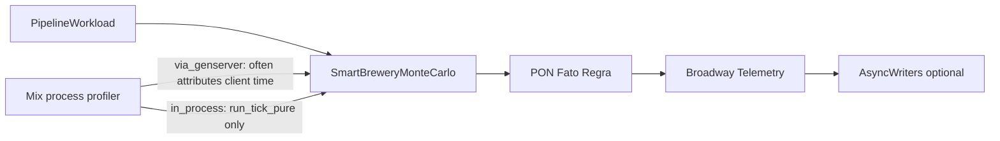

*If this helped you, you can [support the author with a coffee on dev.to](https://dev.to/matheuscamarques/support-with-a-coffee-2oa0).*

# Dev profiling: CPU, memory, and what changed after optimizations

**Part 11 of 12** — [Part 10 on dev.to — When notifications explode: message storms, deduplication, and back-pressure in PON](https://dev.to/matheuscamarques/when-notifications-explode-message-storms-deduplication-and-back-pressure-in-pon-34p4) · [repo draft](10_when_notifications_explode_message_storms_pon.md) described **deduplication**, **fan-out batching**, and **mailbox draining** in the PON core. Those changes are meant to reduce wasted work—but you only know they helped if you **measure** the same workload twice under the same knobs.

This post is a practical guide to **dev profiling** in this monorepo: reproducible load via **`SimulacoesVisuais.Profile.PipelineWorkload`**, Mix tasks built on OTP profilers, and how to read results without fooling yourself. Deep dives and longer checklists live in **[`docs/performance-dev.md`](../../performance-dev.md)** and **[`docs/memory-pressure-heuristics.md`](../../memory-pressure-heuristics.md)**. **Part 12** closes the series with a retrospective.

---

## What profilers actually show

On the BEAM, **`mix profile.cprof`**, **`eprof`**, **`fprof`**, and (OTP 27+) **`tprof`** answer different questions (official task docs under [Mix.Tasks.Profile](https://hexdocs.pm/mix/Mix.Tasks.Profile.Cprof.html) on HexDocs; flags and caveats in this repo are expanded in [`performance-dev.md`](../../performance-dev.md)):

| Tool | Rough question |
|------|----------------|
| **cprof** | Which functions ran **most often**? |
| **eprof** | Where did **this process** spend time? |
| **fprof** | What does the **call graph** look like in time? |
| **tprof** | Aggregated **time**, **calls**, or **allocation** (WORDS) across processes |

None of them is a direct “heap map.” **RAM pressure** still needs `:erlang.memory/0`, **`Process.info/2`**, Observer, or LiveDashboard VM metrics—hot code paths that allocate a lot often correlate with high call counts, but correlation is not identity.

---

## Reproducible load: `PipelineWorkload`

The module **[`SimulacoesVisuais.Profile.PipelineWorkload`](../../apps/simulacoes_visuais/lib/simulacoes_visuais/profile/pipeline_workload.ex)** runs **Monte Carlo ticks** through the same stack as production-style simulation: PON facts, hybrid models, telemetry fan-out, and (if enabled) TSDB writers.

```elixir
# SimulacoesVisuais.Profile.PipelineWorkload.run/1 (opening)
def run(opts \\ []) when is_list(opts) do
  duration_ms = Keyword.get(opts, :duration_ms) || env_duration_ms()
  ticks = Keyword.get(opts, :ticks, env_int("PROFILE_PIPELINE_TICKS", 30))
  max_ticks = Keyword.get(opts, :max_ticks, env_int("PROFILE_PIPELINE_MAX_TICKS", 5_000_000))
  mode = Keyword.get(opts, :mode, mode_from_env())
  memory? = Keyword.get(opts, :memory, env_bool("PROFILE_PIPELINE_MEMORY", false))

  {:ok, _} = Application.ensure_all_started(:simulacoes_visuais)
  MonteCarlo.stop_loop()
  if memory?, do: print_memory_section("before")
  # … duration_ms branch → run_until_deadline_* OR fixed tick count …
  if memory?, do: print_memory_section("after")
  :ok
end
```

### Two modes matter for interpretation

- **`:via_genserver`** (default) — calls **`SmartBreweryMonteCarlo.run_tick_sync/0`**. Realistic for end-to-end behavior; some profilers attribute time to the **caller** (e.g. Mix) as much as to the GenServer body.
- **`:in_process`** — **`PROFILE_PIPELINE_MODE=in_process`** runs **`run_tick_pure/1`** in the **current** process. Better for **`fprof`**-style call graphs; **does not** advance the live GenServer RNG state—profiling only.

Set duration instead of a fixed tick count with **`PROFILE_PIPELINE_DURATION_MS`** (milliseconds wall clock), capped by **`PROFILE_PIPELINE_MAX_TICKS`**.

---

## Environment variables (cheat sheet)

| Variable | Role |
|----------|------|
| `PROFILE_PIPELINE_TICKS` | Fixed number of ticks when duration is off |
| `PROFILE_PIPELINE_DURATION_MS` | Run until wall-clock deadline |
| `PROFILE_PIPELINE_MAX_TICKS` | Safety ceiling for duration mode |
| `PROFILE_PIPELINE_MODE` | `via_genserver` (default) or `in_process` |
| `PROFILE_PIPELINE_MEMORY` | `1` / `true` → print `:erlang.memory/0` + key processes before/after |
| `SIMULACOES_TSDB_ENABLED` | Match your DB-on vs DB-off scenario |
| `LOGGER_LEVEL` | Often `warning` to reduce log noise during long runs |

For **before/after** comparisons, also lock Monte Carlo and pipeline tuning: `MONTE_CARLO_INTERVAL_MS`, `MONTE_CARLO_FACTS_PER_TICK_MIN` / `MAX`, `TELEMETRY_PIPELINE_BATCH_SIZE`, `TELEMETRY_PIPELINE_BATCH_TIMEOUT_MS`, `TELEMETRY_PRODUCER_MAX_QUEUE`, `OEE_PUBSUB_MIN_INTERVAL_MS`—see the tables in [`performance-dev.md`](../../performance-dev.md).

---

## Quick commands

**Call-count hotspot (cprof), TSDB off, long window:**

```bash
cd apps/simulacoes_visuais
mkdir -p tmp/profile
PROFILE_PIPELINE_DURATION_MS=120000 LOGGER_LEVEL=warning \
  SIMULACOES_TSDB_ENABLED=false \
  mix profile.cprof -e "SimulacoesVisuais.Profile.PipelineWorkload.run()" \
  | tee tmp/profile/cprof-sample.txt
```

**Narrow to one module:**

```bash
mix profile.cprof --module SimulacoesVisuais.SmartBreweryMonteCarlo \
  -e "SimulacoesVisuais.Profile.PipelineWorkload.run()"
```

**Memory snapshot without a profiler:**

```bash
PROFILE_PIPELINE_MEMORY=1 PROFILE_PIPELINE_TICKS=30 \
  mix profile.pipeline
# alias for: mix simulacoes_visuais.profile_workload
```

**OTP 27+ aggregated time:**

```bash
PROFILE_PIPELINE_DURATION_MS=120000 LOGGER_LEVEL=warning \
  mix profile.tprof --type time --report total \
  -e "SimulacoesVisuais.Profile.PipelineWorkload.run()"
```

**fprof trace file** — put **`-e "..."` before `--trace-to-file`**, or Mix mis-parses the path:

```bash
mix profile.fprof -e "SimulacoesVisuais.Profile.PipelineWorkload.run()" \
  --trace-to-file tmp/profile/run.trace \
  | tee tmp/profile/fprof-out.txt
```

---

## 60-second battery

From the repo root, **[`scripts/run_profile_60s.sh`](../../scripts/run_profile_60s.sh)** runs several profiler variants and writes under **`apps/simulacoes_visuais/tmp/profile/*-60s.txt`**. Useful when you want comparable artifacts after a change without hand-typing flags.

---

## Profiling the Monte Carlo GenServer itself

With **`PipelineWorkload`** in default **`via_genserver`** mode, **`eprof`** attached to the Mix process often shows **`GenServer.call`** / client time—not the full body of **`SmartBreweryMonteCarlo`**. To attribute work to the right OTP process:

1. Start the app (`mix phx.server` or `Application.ensure_all_started(:simulacoes_visuais)`).
2. Resolve PIDs: `Process.whereis(SimulacoesVisuais.SmartBreweryMonteCarlo)`, and when TSDB is on, writers such as **`RuleEventWriter`**.
3. Attach **`eprof`** / **`fprof`** to those PIDs from an **`iex`** session on the same node (see OTP profiling docs), while generating load from **another** shell or the UI.

Cross-check **reductions** and **mailbox length** in Observer or LiveDashboard while **`PROFILE_PIPELINE_MEMORY=1`** prints heap and queue depth for the registered names the workload already tracks.

---

## Baselines: “light” vs “heavy” server

Before blaming PON, confirm whether you are in a **quiet** or **noisy** dev profile. [`performance-dev.md`](../../performance-dev.md) suggests:

```bash
# Lighter: no TSDB, no auto Monte Carlo
PHX_LV_DEBUG=0 SIMULACOES_TSDB_ENABLED=false AUTO_START_MONTE_CARLO=false mix phx.server
```

```bash
# Heavier: TSDB, fast MC, more LiveView debug
PHX_LV_DEBUG=1 SIMULACOES_TSDB_ENABLED=true AUTO_START_MONTE_CARLO=true \
  MONTE_CARLO_INTERVAL_MS=500 mix phx.server
```

Profiling workloads should use the **same** economic assumptions as the hypothesis you are testing.

---

## Optimizations this repo ties to measurements

Internal write-ups (Portuguese) connect architecture to numbers: **[article 18](../../docs/artigos/18_arquitetura_runtime_smart_brewery_e_resultados_de_desempenho.md)** (runtime), **[article 19](../../docs/artigos/19_mitigacao_message_storm_pon_elixir_smart_brewery.md)** (message storm mitigation), **[article 20](../../docs/artigos/20_otimizacao_simulacao_hibrida_pon_elixir.md)** (ETS `write_concurrency`, Registry partitions, Rete spike, Broadway tuning). The **checklist** at the top of [`performance-dev.md`](../../performance-dev.md) maps each item to modules—for example: **`Registry` partitions** in `Tec0301Pon.Application`, **ETS** `read_concurrency` / `write_concurrency` on fact values, **Broadway** `:telemetry_pipeline_processor_concurrency` / batcher settings in config, **`Fanout`** switching to **`Task.async_stream`** when the update map has more than four pairs, and optional **Rete** experiments via `Tec0301Pon.PON.ReteSpike`. Profiling tells you which row in that table actually matters for *your* tick rate and hardware.

Do **not** publish a single “we saved 40%” headline unless you have **paired** runs (same commit range, same env, same `PROFILE_PIPELINE_*`) and you document where the files live—otherwise you are storytelling, not benchmarking.

---

## BI / TSDB sanity (one paragraph)

If charts look empty while `telemetry_events` has millions of rows, check **time windows**: `mix verify.bi` uses small **`LIMIT`** samples and often **last 24h** in SQL; **`mix verify.tsdb`** reports **global** counts and **`MAX(ts)`**. Misaligned windows are a data issue, not a broken query—see [`performance-dev.md`](../../performance-dev.md) § BI native.

---

## Flow under profiling



---

## Summary

**Part 10** reduced redundant messages; **Part 11** gives you the **bench**: `PipelineWorkload`, Mix profilers, memory snapshots, and explicit env discipline. Treat every optimization as a **hypothesis** until two traces agree. **Part 12** zooms out with a series retrospective and a full index of posts.

## References and further reading

- **Mix profiling** — `profile.cprof`, `profile.eprof`, `profile.fprof`, `profile.tprof` — [HexDocs (cprof)](https://hexdocs.pm/mix/Mix.Tasks.Profile.Cprof.html) and sibling tasks.
- **Armstrong (2003)** — process isolation and failure domains — [thesis PDF](https://www.erlang.org/download/armstrong_thesis_2003.pdf) (context for why mailbox/profiler stories matter).
- **In this repo** — [`pipeline_workload.ex`](../../apps/simulacoes_visuais/lib/simulacoes_visuais/profile/pipeline_workload.ex), [`performance-dev.md`](../../docs/performance-dev.md), [`memory-pressure-heuristics.md`](../../docs/memory-pressure-heuristics.md), [`run_profile_60s.sh`](../../scripts/run_profile_60s.sh); internal articles [18](../../docs/artigos/18_arquitetura_runtime_smart_brewery_e_resultados_de_desempenho.md), [20](../../docs/artigos/20_otimizacao_simulacao_hibrida_pon_elixir.md). Expanded list: [Bibliography on dev.to — PON + Smart Brewery series (EN drafts)](https://dev.to/matheuscamarques/bibliography-pon-smart-brewery-devto-series-en-drafts-58a9) · [repo draft](../BIBLIOGRAPHY_PON_SERIES.md).

---

**Published on dev.to:** [Dev profiling: CPU, memory, and what changed after optimizations](https://dev.to/matheuscamarques/dev-profiling-cpu-memory-and-what-changed-after-optimizations-28hb) — tracked in [`docs/devto_serie_pon_smart_brewery.md`](../../devto_serie_pon_smart_brewery.md).

**Previous:** [Part 10 on dev.to — When notifications explode: message storms, deduplication, and back-pressure in PON](https://dev.to/matheuscamarques/when-notifications-explode-message-storms-deduplication-and-back-pressure-in-pon-34p4) · [repo draft](10_when_notifications_explode_message_storms_pon.md)  
**Next:** [Part 12 — Retrospective: lessons from building a reactive rules engine in Elixir](12_retrospective_reactive_rules_engine_elixir.md) — *end of series* (index + lessons learned).
