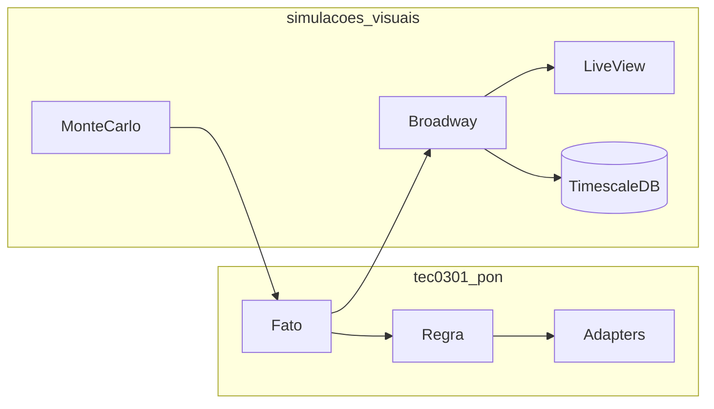

*If this helped you, you can [support the author with a coffee on dev.to](https://dev.to/matheuscamarques/support-with-a-coffee-2oa0).*

# Retrospective: lessons from building a reactive rules engine in Elixir

**Part 12 of 12** — This post closes the arc that started with **why** the BEAM fits reactive rules and ends with **how** we measure them under load. [Part 11 on dev.to — Dev profiling: CPU, memory, and what changed after optimizations](https://dev.to/matheuscamarques/dev-profiling-cpu-memory-and-what-changed-after-optimizations-28hb) · [repo draft](11_dev_profiling_cpu_memory_optimizations.md) was about profilers and reproducible workloads; here I zoom out: **integrations that paid off**, **costs we accepted**, and **what I would try next** if I were green-fielding tomorrow.

This is not a substitute for the earlier technical posts—treat it as a **map** and a **checklist** for your own PON-style systems. Each part now ends with a **References and further reading** section; the consolidated list lives in [Bibliography on dev.to — PON + Smart Brewery series (EN drafts)](https://dev.to/matheuscamarques/bibliography-pon-smart-brewery-devto-series-en-drafts-58a9) · [repo draft](../BIBLIOGRAPHY_PON_SERIES.md).

---

## What the twelve parts built

| Stretch | Idea |
|---------|------|
| **1–2** | Notifications as the organizing principle; **Facts**, **Rules**, and **Premises** as OTP processes and `Registry` topics. |
| **3–4** | Less boilerplate via **`defrule`** / **`defpremissa`**; **ports and adapters** so rules do not hard-code IO. |
| **5–6** | **Smart Brewery** as a serious lab; **LiveView** as the operator’s window with batching and streams. |
| **7–8** | **Broadway / GenStage**, **TimescaleDB**, star-schema **BI** and safe read-only roles. |
| **9** | **ML export / import** and **`ml_predictions`** without blocking the engine. |
| **10–11** | [**Part 10 on dev.to**](https://dev.to/matheuscamarques/when-notifications-explode-message-storms-deduplication-and-back-pressure-in-pon-34p4) — **message storms**, dedup and fan-out coalescence; [**Part 11 on dev.to**](https://dev.to/matheuscamarques/dev-profiling-cpu-memory-and-what-changed-after-optimizations-28hb) — **CPU/memory profiling** with `PipelineWorkload`. |

Together they describe one opinionated path: **reactive core**, **async edges**, **honest measurement**.

---

## What worked well

**Process boundaries match mental boundaries.** A `Fato` is a named mailbox with a value; a `Regra` subscribes and reacts. That maps cleanly to drawings on a whiteboard and to Elixir supervision.

**Explicit message shapes.** Consumers understand `{:notificacao, name, value}` and `{:notificacoes_lote, map}`—whether they live in `tec0301_pon` or in the Phoenix app. Ambiguity is expensive at scale.

**Two applications, one story.** Keeping **`tec0301_pon`** as the engine and **`simulacoes_visuais`** as warehouse + UI avoided turning the rule engine into an Ecto or HTTP library, while still shipping a full twin demo.

**Batching at the pain points.** LiveView batchers, Broadway batchers, `Fanout.atualizar_lote/1`, and async DB writers share the same philosophy: **coalesce before fan-out or disk**.

**Telemetry as a spine, not an afterthought.** From rule firings to Broadway flushes, the codebase repeatedly uses `:telemetry.execute/3` and named events so you can correlate “the twin moved” with “the UI updated” and “rows landed in TimescaleDB.” That does not replace profilers, but it **anchors** them: when CPU spikes, you want a span or counter that says *which* stage grew.

---

## Trade-offs we accepted

**DSL complexity.** Macros that generate rule modules are powerful and testable, but they are a onboarding cliff. Teams that fear metaprogramming will push for YAML or database rules—each has its own cost.

**Simulation vs. fidelity vs. CPU.** Monte Carlo noise, strict `===` deduplication, and float quantization are linked: quieter logs mean less work, but also less “physical” continuity unless you design for it.

**Pragmatic coupling in examples.** Rules that call `Adapters.PredioIO` directly are easy to read; “production-shaped” indirection via `Application.get_env/3` is more wiring. The series kept both stories visible.

**Operational surface.** TimescaleDB, CAGGs, retention, Power BI roles, and ML export paths are **optional** but real: the default `mix phx.server` story is heavier than a pure library.

**English drafts, Portuguese publication layer.** Keeping `docs/devto/en/*.md` as the paste-ready source while `devto_serie_pon_smart_brewery.md` tracks PT titles and dev.to slugs adds a bit of bookkeeping. The upside is a single technical narrative in one language and localized packaging when you hit publish.

---

## What I would try earlier next time

- **Profiling harness from week one** — `PipelineWorkload`-style reproducible ticks save arguments about regressions.
- **One canonical env matrix** — document `SIMULACOES_TSDB_ENABLED`, Monte Carlo interval, and Broadway batch sizes in a single table (the repo now spreads this across `performance-dev.md` and config; still easy to drift).
- **Stable join keys** — align persisted `rule_events.regra_id` with dimension tables (`r_01` vs `"1"`) in one migration or view, so BI and ML exports do not need ad hoc bridges.
- **Stricter “no work if unchanged” policy** — extend the dedup story to any hot path that allocates (e.g. telemetry encode) once profiling proves it matters.

These are **hypotheses**, not promises—verify on your workload.

---

## Code spine (the same system, twelve lenses)

*Part 2 / 10 — fact update and dispatch only when the value changes:*

```elixir
# lib/tec0301_pon/pon/fato.ex (concept)
def handle_cast({:atualizar, novo_valor}, estado) do
  if valor_igual?(estado.valor, novo_valor) do
    {:noreply, estado}
  else
    # … update state, ETS, Registry.dispatch → {:notificacao, nome, valor}
    {:noreply, novo_estado}
  end
end
```

*Part 3 — DSL-shaped rule:*

```elixir
defrule RegraIrrigacao,
  watch: [:temp_ambiente, :umidade_solo, :estado_bomba, :nivel_tanque],
  when: memoria[:temp_ambiente] > 30 and memoria[:umidade_solo] < 40,
  do: (
    Adapters.BombaDeAgua.ligar()
    Tec0301Pon.PON.Fato.atualizar(:estado_bomba, :ligada)
  )
```

*Part 4 — port = behaviour:*

```elixir
defmodule Tec0301Pon.Ports.PredioAtuadores do
  @callback ligar_luz() :: :ok
  @callback trancar_porta() :: :ok
end
```

*Part 6 — operator route:*

```elixir
live "/smart-brewery", SmartBreweryLive, :index
live "/smart-brewery/ml-predictions", MlPredictionsLive, :index
```

*Part 7 — Broadway flush to PubSub and optional TSDB:*

```elixir
if Application.get_env(:simulacoes_visuais, :tsdb_enabled, false) do
  SimulacoesVisuais.SmartBrewery.TelemetryAsyncWriter.cast_batch(list)
end
```

*Part 9 — export and import (shell):*

```bash
mix export.ml --out /tmp/ml_export --since-hours 168
mix import.ml.predictions --file /tmp/preds.jsonl
```

*[**Part 11 on dev.to**](https://dev.to/matheuscamarques/dev-profiling-cpu-memory-and-what-changed-after-optimizations-28hb) — reproducible load:*

```bash
mix profile.cprof -e "SimulacoesVisuais.Profile.PipelineWorkload.run()"
```

---

## End-to-end picture



---

## Series index (parts 1–12 + consolidated bibliography)

| Part | Title | Draft / published |
|-----:|--------|-------------------|
| 1 | Notification-Oriented Paradigm (PON) in Elixir: why the BEAM fits reactive rules | [dev.to](https://dev.to/matheuscamarques/notification-oriented-paradigm-pon-in-elixir-why-the-beam-fits-reactive-rules-2p9e) · [repo draft](01_pon_in_elixir_why_beam.md) |
| 2 | From whiteboard to code: mapping Facts, Rules, and Premises to OTP processes | [dev.to](https://dev.to/matheuscamarques/from-whiteboard-to-code-mapping-facts-rules-and-premises-to-otp-processes-1blb) · [repo draft](02_from_whiteboard_to_code_otp.md) |
| 3 | A metaprogrammed DSL: `defrule` and `defpremissa` with less PON boilerplate | [dev.to](https://dev.to/matheuscamarques/a-metaprogrammed-dsl-defrule-and-defpremissa-with-less-pon-boilerplate-3909) · [repo draft](03_metaprogrammed_dsl_defrule_defpremissa.md) |
| 4 | Hexagonal architecture + PON: Ports & Adapters to decouple the engine | [dev.to](https://dev.to/matheuscamarques/hexagonal-architecture-pon-ports-adapters-to-decouple-the-engine-3l54) · [repo draft](04_hexagonal_pon_ports_adapters.md) |
| 5 | Smart Brewery: a digital twin brewery as a PON lab | [dev.to](https://dev.to/matheuscamarques/smart-brewery-a-digital-twin-brewery-as-a-pon-lab-36mf) · [repo draft](05_smart_brewery_digital_twin_pon_lab.md) |
| 6 | Phoenix LiveView in real time: an operations UI on top of a rules engine | [dev.to](https://dev.to/matheuscamarques/phoenix-liveview-in-real-time-an-operations-ui-on-top-of-a-rules-engine-17ci) · [repo draft](06_phoenix_liveview_operations_ui_rules_engine.md) |
| 7 | From simulation to storage: telemetry, Broadway/GenStage, and TimescaleDB | [dev.to](https://dev.to/matheuscamarques/from-simulation-to-storage-telemetry-broadwaygenstage-and-timescaledb-762) · [repo draft](07_from_simulation_to_storage_telemetry_broadway_timescaledb.md) |
| 8 | BI without mystery: dimensions, facts, and consuming the data (e.g. Power BI) | [dev.to](https://dev.to/matheuscamarques/bi-without-mystery-dimensions-facts-and-consuming-the-data-eg-power-bi-54aj) · [repo draft](08_bi_without_mystery_dimensions_facts_power_bi.md) |
| 9 | ML on the digital twin: export, train pilots, and import predictions back into the app | [dev.to](https://dev.to/matheuscamarques/ml-on-the-digital-twin-export-train-pilots-and-import-predictions-back-into-the-app-207i) · [repo draft](09_ml_digital_twin_export_train_import_predictions.md) |
| 10 | When notifications explode: message storms, deduplication, and back-pressure in PON | [dev.to](https://dev.to/matheuscamarques/when-notifications-explode-message-storms-deduplication-and-back-pressure-in-pon-34p4) · [repo draft](10_when_notifications_explode_message_storms_pon.md) |
| 11 | Dev profiling: CPU, memory, and what changed after optimizations | [dev.to](https://dev.to/matheuscamarques/dev-profiling-cpu-memory-and-what-changed-after-optimizations-28hb) · [repo draft](11_dev_profiling_cpu_memory_optimizations.md) |
| 12 | Retrospective: lessons from building a reactive rules engine in Elixir | *this post* |
| 13 | Bibliography — PON + Smart Brewery dev.to series (EN drafts) | [dev.to](https://dev.to/matheuscamarques/bibliography-pon-smart-brewery-devto-series-en-drafts-58a9) · [repo draft](../BIBLIOGRAPHY_PON_SERIES.md) |

Portuguese titles and publication notes for dev.to live in [`docs/devto_serie_pon_smart_brewery.md`](../../devto_serie_pon_smart_brewery.md).

## References and further reading (series-level)

- **Master bibliography** — normalized table of books, papers, and docs used across Parts 1–12: [Bibliography on dev.to — PON + Smart Brewery series (EN drafts)](https://dev.to/matheuscamarques/bibliography-pon-smart-brewery-devto-series-en-drafts-58a9) · [repo draft](../BIBLIOGRAPHY_PON_SERIES.md).
- **NOP / PON** — Simão et al. (2013) comparative study — [SCIRP](https://www.scirp.org/journal/paperinformation?paperid=19842).
- **OTP / BEAM** — Armstrong (2003) thesis — [PDF](https://www.erlang.org/download/armstrong_thesis_2003.pdf); Cesarini & Thompson, *Programming Erlang*.
- **Hexagonal** — Cockburn — [ports and adapters](https://alistair.cockburn.us/hexagonal-architecture/).
- **Data + time-series** — Kimball & Ross (dimensional modeling); TimescaleDB — [docs.timescale.com](https://docs.timescale.com/).
- **ML readiness** — Breck et al., *ML Test Score* — [Google Research](https://research.google/pubs/pub46555/).

---

## Thank you

If you followed from [Part 1 on dev.to](https://dev.to/matheuscamarques/notification-oriented-paradigm-pon-in-elixir-why-the-beam-fits-reactive-rules-2p9e): you have seen **one** way to marry reactive rules, OTP, and industrial-style twins—not the only way. Take the **patterns** (boundaries, batching, measurement) and adapt the **machinery** to your domain.

**End of series.**

---

**Previous:** [Part 11 on dev.to — Dev profiling: CPU, memory, and what changed after optimizations](https://dev.to/matheuscamarques/dev-profiling-cpu-memory-and-what-changed-after-optimizations-28hb) · [repo draft](11_dev_profiling_cpu_memory_optimizations.md)

**Code map (monorepo root):** `lib/tec0301_pon/`, `apps/simulacoes_visuais/`, `docs/performance-dev.md`, `docs/devto_serie_pon_smart_brewery.md`.
