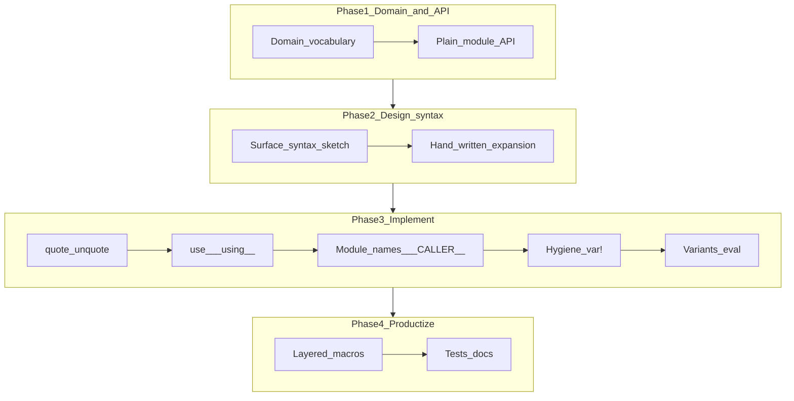

# Building DSLs in Elixir — series index (EN drafts)

English-language article drafts for a **cross-cutting** tutorial track: how to design and implement **macros and small DSLs** in Elixir, using this repo’s [`Tec0301Pon.PON.Builder`](../../../lib/tec0301_pon/pon/builder.ex) and [`lib/tec0301_pon/examples/`](../../../lib/tec0301_pon/examples/) as the running textbook.

**Read time:** each part is a **long-form** draft of roughly **2,000+ words**—about **10+ minutes** at ~200 wpm (up to ~2,600 words in places). Skim-friendly subheads and checklists are intentional; the serial still expects a slow read beside Riverbank.

## The story (read Parts 1–10 in order)

The drafts are written as a **serial**: a fictional team at **Riverbank Greenhouse**—**Maya** (pushes toward macros), **Jordan** (demands a plain API and golden expansions first), **Sam** (platform / security and product asks)—builds an internal rule DSL that mirrors the *mechanics* of `Tec0301Pon.PON.Builder`. Each part opens with a short scene, carries the plot beat listed below, then teaches the Elixir topic. The **tec0301_pon** code remains the factual reference; Riverbank is narrative glue, not a second product series.

**How to read:** start at [Part 1](01_when_not_to_reach_for_macros.md) and follow the “Next” link at the bottom of each file through [Part 10](10_testing_and_inspecting_macros.md). Skipping around still works for lookup, but the emotional through-line is chronological.

## dev.to frontmatter convention

Use a dedicated series slug so these posts are grouped separately from the PON product narrative:

```yaml
series: elixir-dsl-building
published: false
```

Adjust `published` when a post goes live. Draft filenames in this folder: `01_…md`, `02_…md`, etc.

## Relation to the PON / Smart Brewery series (do not duplicate)

The Smart Brewery line includes [**Part 3 — A metaprogrammed DSL: `defrule` and `defpremissa`**](../03_metaprogrammed_dsl_defrule_defpremissa.md) (`series: pon-smart-brewery`). That post explains **what** the PON rule DSL does inside the reactive engine.

**This series is complementary, not a replacement:** it focuses on **Elixir metaprogramming craft** (AST, `__CALLER__`, hygiene, multi-head macros, etc.). Link to Part 3 when you need domain context for `defrule` / `defpremissa`; avoid re-explaining the full OTP/PON architecture here—that stays in the 12-part track.

## End-to-end: what “building a DSL” looks like here

These drafts are written as a **process**, not only as isolated tips. In practice, an **internal DSL** in Elixir is almost always: *(a)* a clear **runtime API** you could call by hand, plus *(b)* a **compile-time skin** that generates modules and functions so authors do not repeat that API.

**Typical sequence** (expanded narratively in Parts 1–10):

1. **Anchor the domain** — What nouns and verbs must authors write? What do they compile *into* (processes, callbacks, data)?
2. **Prove the API without macros** — One happy path in plain modules proves you understand semantics before you automate syntax.
3. **Inventory repetition** — Every repeated `defmodule` / `start_link` / callback pair is a candidate for generation.
4. **Design the surface syntax** — It must be **legal Elixir** (calls, blocks, keyword lists). You are curating how people spell ideas, not inventing a new lexer unless you choose an external DSL.
5. **Write expansions by hand** — For each macro form, draft the **exact** code you wish existed after compilation. That is your specification for `quote`.
6. **Implement macros** — `quote` templates, `unquote` holes, `bind_quoted` when many values inject; keep heavy logic in `defp`, not in macro bodies.
7. **Name generated modules** — Normalize AST for aliases (`__aliases__`), use `Module.concat` and `__CALLER__.module` so code lands in the author’s namespace.
8. **Respect hygiene** — Use `var!` only to tie **template parameters** to **user-supplied fragments** (e.g. `memoria`).
9. **Handle variants** — Multiple `defmacro` heads and inner `case`/`cond` for optional keywords and different `do:` shapes.
10. **Choose eval vs AST deliberately** — Prefer AST; reserve string eval for controlled, documented escape hatches.
11. **Layer languages** — Smaller macros (`defpremissa`, `defcondicao`) that compose with the main form.
12. **Test and document** — Smoke-compile, behavior tests on generated modules, author-facing contracts (`use`, required macro placement).



| Phase | Parts |
| --- | --- |
| Decide macros vs plain API, staging | [01](01_when_not_to_reach_for_macros.md) |
| AST tools, templates | [02](02_ast_essentials_quote_unquote_bind_quoted.md) |
| Author entry `use` | [03](03_use_pattern___using__.md) |
| Generated module names | [04](04_generating_modules_names_from_macro_arguments.md), [05](05___CALLER___and_lexical_module_context.md) |
| Hygiene | [06](06_hygiene_and_var_bang_injecting_memoria_safely.md) |
| Syntax variants | [07](07_multi_head_macros_and_alternative_shapes.md), [08](08_eval_strings_vs_quoted_ast_escape_hatch.md) |
| Composition + examples | [09](09_layered_dsls_premises_conditions_examples.md) |
| Quality bar | [10](10_testing_and_inspecting_macros.md) |

## Article roadmap

| Part | Working title (EN) | Teaching focus | Primary repo anchors |
| --- | --- | --- | --- |
| 1 | When (not) to reach for macros | Plain APIs vs DSL sugar; mental cost; compile-time vs runtime; when `defmacro` earns its keep | [lib/tec0301_pon.ex](../../../lib/tec0301_pon.ex) |
| 2 | AST essentials: `quote`, `unquote`, and `bind_quoted` | Reading AST; building fragments; avoiding bad `unquote`; `bind_quoted` for body-bound variables | [builder.ex](../../../lib/tec0301_pon/pon/builder.ex) |
| 3 | The `use` pattern: `__using__` as your DSL’s front door | `use MyDSL` → `import` / `alias` / options; contract for authors | `__using__/1` in Builder |
| 4 | Generating modules: names from macro arguments | `defmodule unquote(...)`; `{:__aliases__, _, parts}` vs atom; `Module.concat/2` for nested modules | `build_defrule_ast/6`, `build_defpremissa/6` (name resolution) |
| 5 | `__CALLER__` and lexical module context | Why generated modules need the parent module; debugging “where was this defined?” | Any `build_*(_, caller)` in Builder |
| 6 | Hygiene and `var!`: injecting `memoria` safely | Why `memoria` appears in clauses; `var!(memoria)` in generated `def`s; common pitfalls | `avaliar(var!(memoria))` / `executar` in Builder |
| 7 | Multi-head macros and alternative shapes | Several `defmacro` heads (e.g. binary vs AST `when:`); branches (`instigations:` vs block `do:`); options like `edge_triggered` | `defrule` clauses + `case acao` in `build_defrule_ast` |
| 8 | Eval strings vs quoted AST: a deliberate escape hatch | When `Code.eval_string` is acceptable (config, prototypes); risks (tests, security, refactor); prefer AST | `build_defrule_string` / `when is_binary` clauses |
| 9 | Layered DSLs: premises, aggregate conditions, and real examples | `defpremissa` / `defcondicao` as a second layer; short walkthrough of sample rule modules | [estufa_regras.ex](../../../lib/tec0301_pon/examples/estufa_regras.ex), [alarme_simples_regras.ex](../../../lib/tec0301_pon/examples/alarme_simples_regras.ex), [smart_brewery_regras.ex](../../../lib/tec0301_pon/examples/smart_brewery_regras.ex); see also [vendas_regras.ex](../../../lib/tec0301_pon/examples/vendas_regras.ex), [predio_inteligente_regras.ex](../../../lib/tec0301_pon/examples/predio_inteligente_regras.ex), [mira_alvo_regras.ex](../../../lib/tec0301_pon/examples/mira_alvo_regras.ex), [portao_eletronico_regras.ex](../../../lib/tec0301_pon/examples/portao_eletronico_regras.ex), [alarme_correlacao_regras.ex](../../../lib/tec0301_pon/examples/alarme_correlacao_regras.ex) |
| 10 | Testing and inspecting macros (epilogue) | `Macro.expand/2`, `Code.compile_string/2`, golden AST checks vs integration smoke tests; CI closure for the serial | [10_testing_and_inspecting_macros.md](10_testing_and_inspecting_macros.md) |

## Progression (for talks or landing copy)

Same journey as **The story** above: left-to-right matches Maya and Jordan’s timeline from decision → AST → ship.


## Scope boundaries (keep the series teachable)

- Do **not** retell the full PON/OTP architecture—that remains under `pon-smart-brewery`.
- Do **not** turn each post into a Phoenix/LiveView tutorial; mention integration only when it motivates generated `start_link/0` or similar.

## Further reading

- **Series bibliography (DSL theory, hygiene, staging, testing):** [BIBLIOGRAPHY_DSL_SERIES.md](BIBLIOGRAPHY_DSL_SERIES.md).
- Elixir [`Macro`](https://hexdocs.pm/elixir/Macro.html) documentation.
- Chris McCord, *Metaprogramming Elixir* (Pragmatic Bookshelf).
- Normalized citations shared with the PON track: [BIBLIOGRAPHY_PON_SERIES.md](../../BIBLIOGRAPHY_PON_SERIES.md).

## Draft files in this folder

| File | Status |
| --- | --- |
| [01_when_not_to_reach_for_macros.md](01_when_not_to_reach_for_macros.md) | Full draft |
| [02_ast_essentials_quote_unquote_bind_quoted.md](02_ast_essentials_quote_unquote_bind_quoted.md) | Full draft |
| [03_use_pattern___using__.md](03_use_pattern___using__.md) | Full draft |
| [04_generating_modules_names_from_macro_arguments.md](04_generating_modules_names_from_macro_arguments.md) | Full draft |
| [05___CALLER___and_lexical_module_context.md](05___CALLER___and_lexical_module_context.md) | Full draft |
| [06_hygiene_and_var_bang_injecting_memoria_safely.md](06_hygiene_and_var_bang_injecting_memoria_safely.md) | Full draft |
| [07_multi_head_macros_and_alternative_shapes.md](07_multi_head_macros_and_alternative_shapes.md) | Full draft |
| [08_eval_strings_vs_quoted_ast_escape_hatch.md](08_eval_strings_vs_quoted_ast_escape_hatch.md) | Full draft |
| [09_layered_dsls_premises_conditions_examples.md](09_layered_dsls_premises_conditions_examples.md) | Full draft |
| [10_testing_and_inspecting_macros.md](10_testing_and_inspecting_macros.md) | Full draft (serial epilogue) |
| [BIBLIOGRAPHY_DSL_SERIES.md](BIBLIOGRAPHY_DSL_SERIES.md) | Normalized references (Fowler, Voelter, Kohlbecker et al., PLAI, …) |
